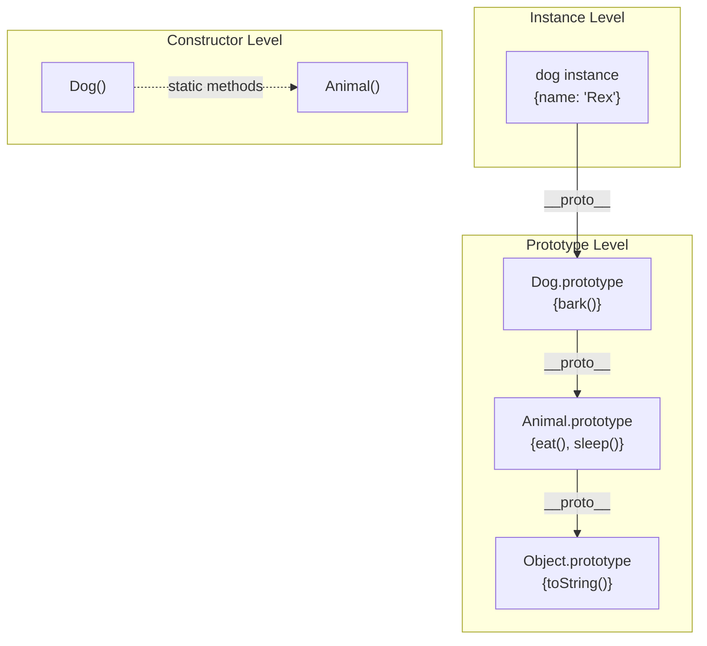
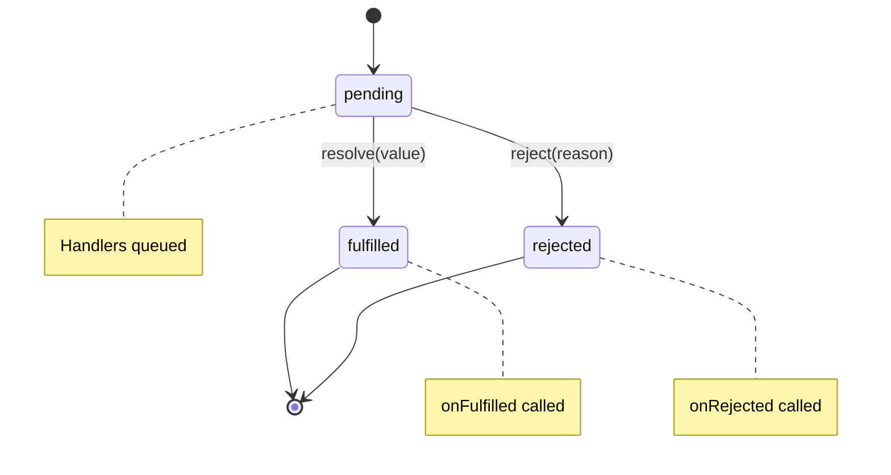
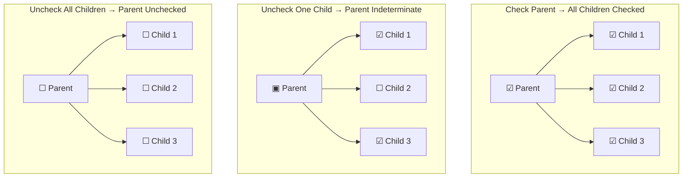
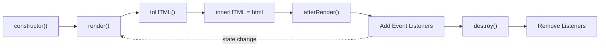
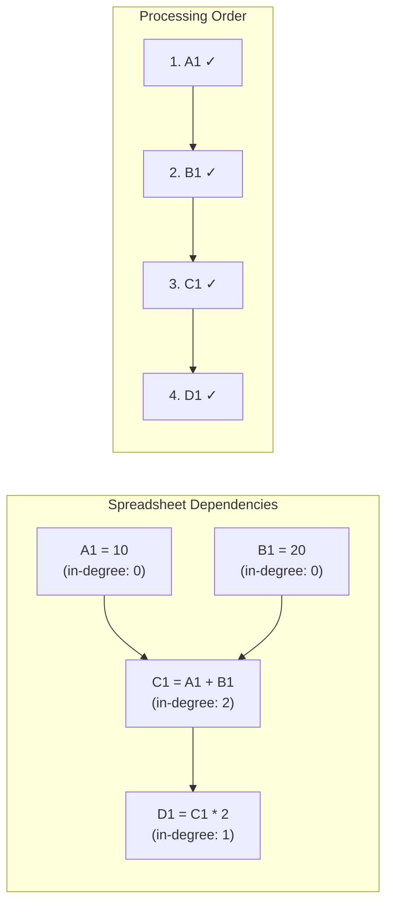
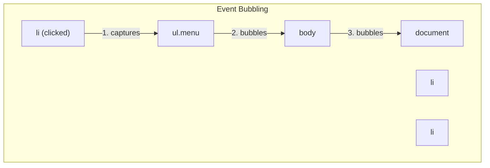
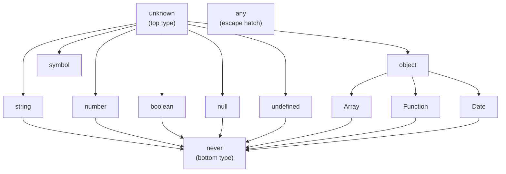

# Frontend Interview Preparation Workshop - Presentation Plan

## 2-Week Preparation Timeline

**Start Date:** February 4, 2026  
**Deadline:** February 18, 2026

---

## Slide Sections Overview

### 1. Introduction (Who Am I)

### 2. General Understanding of Frontend Interview Preparation

### 3. How the Course is Structured

### 4. How to Follow the Course

### 5. Part 1 - Basic JS Questions

### 6. Part 2 - Components

---

## Week 1 (Feb 4 - Feb 10)

### Day 1-2: Introduction & Course Overview Slides

- [ ] Write "Who Am I" section content
- [ ] Prepare personal background and experience highlights
- [ ] Create "General understanding of frontend interview preparation" content
- [ ] Research and include industry statistics/trends

### Day 3-4: Course Structure Slides

- [ ] Write "How the course is structured" section
- [ ] Create visual diagram of course flow
- [ ] Write "How to follow the course" guidelines
- [ ] Add tips for maximizing learning

### Day 5-7: Part 1 - Basic JS Questions

- [ ] Prepare slides for "Solving common JavaScript problems"
- [ ] Create ES5 Inheritance examples and explanations
- [ ] Document Custom Promise Implementation walkthrough
- [ ] Add code snippets and visual explanations

---

## Week 2 (Feb 11 - Feb 17)

### Day 8-10: Part 2 - Day 1 Components

- [ ] Create slides for Accordion, Star Rating, Tabs
- [ ] Document Tooltip, Dialog, Table components
- [ ] Prepare Reddit Thread, Gallery slides
- [ ] Add Nested Checkboxes, Toast component explanations

### Day 11-13: Part 2 - Day 2 Components

- [ ] Calculator, Square Game, Typeahead slides
- [ ] Heatmap, Progress Bar, Upload Component slides
- [ ] Portfolio Visualizer, Markdown Editor content
- [ ] GPT Chat Interface, Infinite Canvas slides
- [ ] Google Sheets Clone breakdown (Parser, Topo Sort, Engine, UX)

### Day 14: TypeScript & Final Review

- [ ] TypeScript Type Challenges slides
- [ ] Final review and polish all sections
- [ ] Practice run-through

---

## Workshop Agenda (Reference)

### Day 1

| Time     | Topic                                                |
| -------- | ---------------------------------------------------- |
| 9:30 AM  | Introduction                                         |
| 9:45 AM  | Solving common JavaScript problems                   |
| 11:15 AM | ES5 Inheritance and Custom Promise Implementation    |
| 12:30 PM | Lunch Break                                          |
| 1:30 PM  | Accordion, Star Rating, Tabs, Tooltip, Dialog, Table |
| 3:15 PM  | Reddit Thread, Gallery, Nested Checkboxes, Toast     |
| 5:00 PM  | Day 1 Wrap Up                                        |

### Day 2

| Time     | Topic                                                                       |
| -------- | --------------------------------------------------------------------------- |
| 9:30 AM  | Advanced Components                                                         |
| 9:45 AM  | Calculator, Square Game, Typeahead, Heatmap, Progress Bar, Upload Component |
| 11:15 AM | Portfolio Visualizer, Markdown Editor                                       |
| 12:30 PM | Lunch Break                                                                 |
| 1:30 PM  | GPT Chat Interface, Infinite Figma-like Canvas                              |
| 3:15 PM  | Google Sheets Clone (Parser, Topo Sort, Engine, UX)                         |
| 4:30 PM  | TypeScript Type Challenges                                                  |
| 5:30 PM  | Day 2 Wrap Up                                                               |

---

## Slide Content Sections

### Slide 1-2: Introduction

Hi everyone, welcome to the Frontend Interview Preparation Workshop. Before we jump into the course, let's start
with a bit of introduction. My name is Evgenii, I work as a Staff UI Engineer at Meta. I've been working as a UI engineer for the last 10 years and I really love Frontend / UI development in general. It's such a fast-paced environment. In the last couple of years I've done a lot of UI interviews and I've definitely seen how the interview process has evolved,
especially in the last year with a rise of AI tooling and stressful economic environment.

What I definitely see now - interviews have become more demanding in general. In the past, you could get away with a good
knowledge of JavaScript and some UI framework or library. Now, the situation is different. You're often asked to build
components from scratch, interviews have become longer and more complex in terms of the things you write.

For me personally, coding is the most stressful part of the interview process. I'll be honest, I'm naturally bad at coding interviews and I think many people can relate to that. The reason for that is when you are under the time pressure, you often can forget even simple things and just stuck on simple problems. Happen to me many times :)

And for me - the main thing that works - is to practice, practice, and practice.

### Slide 1: What this course is about

So this course is about learning through practice by solving non-trivial problems. I want you to learn from my mistakes from my own experience.

### Slide 2: Typical frontend interview structure

Let's first understand the typical frontend interview process that companies use right now

**1. Coding interview** - typically, you'll have 3-6 coding interviews in total, depending on the company. But the most often
setup is the following:

- 1-2 interviews on basic JS questions / Vanilla coding
- 2-3 interviews where you build some features / components either in Vanilla JS or using a library
- 2 interviews that test your Algo / DS skills
- Some companies, ask TypeScript questions during coding interview

**2. System Design** - if you're interviewing for a middle-senior role, you typically have 1 system design interview.
Staff+ engineers usually have 2 system design interviews.

**3. Behavioral interview** - Standard interview where they ask you about your past experience, how you handled certain situations. Basically company tries to understand if you're a good fit for their culture and if you have good communication and conflict resolution skills.

### Slide 3: What are we focusing on in this course

In this course, we'll mostly focus on Components / E2E features coding interviews - as I find it as the the most challeging for engineers. We'll pay less attention to basic JS questions - the reason for it is that you can easily find many resources online to prepare for them. In the course resources I'll attach some free platforms to practice.

For System Design Foundation knowledge - I do recommend checking out my course on Frontend Masters and also my YouTube channel where I have a lot of videos on Frontend System Design.

### Slide 4: Course Plan

**1. Basic JS Questions**

- Detect Type, Debounce, Throttle
- ES5 Inheritance
- Deep Equals, Deep Clone, Stringify
- Custom Promise Implementation
- Tree Select

**2. Components - Day 1**

- Accordion, Star Rating, Tabs
- Tooltip, Dialog, Table
- Reddit Thread, Gallery
- Nested Checkboxes, Toast

**3. Components - Day 2**

- Calculator, Square Game
- Typeahead (Autocomplete)
- Heatmap (Canvas)
- Progress Bar, File Upload
- Portfolio Visualizer
- Markdown Editor

**4. Advanced Components**

- GPT Chat Interface (Streaming)
- Infinite Figma-like Canvas
- Google Sheets Clone
  - Parser & Tokenizer
  - Topological Sorting
  - Table Engine
  - UX / UI

**5. TypeScript Type Challenges**

- Basics, Mapped Types
- Conditional Types, Infer
- Template Literals, Recursion
- Distributive, Advanced Patterns
- Expert Techniques

### Slide 5: Difficulty of the questions

The problems in this workshop are intentionally **slightly harder than real interview questions**.

**The idea is simple:** If you train on harder problems, real interviews will feel calmer and more manageable.

**Problems are grouped into the following difficulty levels:**

1. **Warm-up** - Very basic problems that you should solve quickly. Expected time: **2–4 minutes**.
2. **Easy** - Small 5–10 minute problems. Some companies may give **3–4 easy problems in a 45-minute screening interview**.
3. **Medium** - **15–20 minute** problems. The majority of frontend interview questions fall into this category.
4. **Hard** - **45+ minute** problems that require practice and familiarity with specific browser APIs. During the workshop, we will aim to solve them in **20–25 minutes** to save time, but in real interviews, you would typically spend **45–60 minutes**.
5. **Extreme** - **1–2 hour** end-to-end problems. These usually involve building a **minimal version of a real product feature from scratch**. You may be provided with a mock server or API, and the focus shifts heavily toward **architecture and structure**. Typically asked on the staff level interviews.

We'll scale the difficulty of the problems during the course. We'll start from warm-up problems and gradually move to more complex ones.

### Slide 6: **Finding Solutions**

All problem solutions are included in the course materials and supporting github repo. However, I strongly encourage you to **re-implement the solutions yourself after finishing the course**. That is where the real learning happens.

### Slide 7: **How to follow the course**

1. IDE Setup: VSCode or WebStorm or any other IDE you are comfortable with.
2. Disable AI assistants and autocompletions: you're here to practice and learn, not to get the solution from AI.
3. Mistakes are inevitable. During the course, we'll most likely need to debug the code
4. Only Necessary CSS. We'll not waste precious time on styling the components. The focus will be on logic and structure

### Slide 8: Github Repo structure

The repository is organized to separate your working area from the reference solutions:

**1. Problems Folder** (`src/problems/components/`)
Each component (e.g. `01-accordion`) acts as a self-contained unit:

- **Student Starter Files:**
  - `<name>.react.tsx` (React) or `<name>.vanila.ts` (Vanilla TS)
  - `<name>.module.css` (Styles)
  - _These are the empty files you will work on._
- **Reference Solution:**
  - The `solution/` subfolder contains the full working implementation.
  - Check this only if you are stuck or for comparison after finishing.
- **Component Harness:**
  - `<name>.example.tsx` connects both your implementation and the reference solution to the dashboard.

**2. Shared Utilities**

- **Abstract Component:** Vanilla components extend `AbstractComponent` (`src/problems/components/00-abstract-component/`) which enforces a standard `render()/destroy()` lifecycle.
- **Path Aliases:** configured in `tsconfig.json` to simplify imports:
  - `@course/styles` → `src/utilities/flex.module.css` (Shared Flexbox classes)
  - `@course/cx` → `src/utilities/utility.ts` (Classname concatenation helper)
  - `@course/types` → `src/problems/typescript/types.ts` (Shared types)
- **Global Styles:** `src/reset.css` and `src/app.module.css` handle baseline styling.

### Slide 9: Example of using utility css classes

We use a helper `cx` and a shared `flex` object to compose classes efficiently:

```tsx
import css from './card.module.css'
import flex from '@course/styles' // Shared utility classes
import cx from '@course/cx' // Classname composition helper

export const UserCard = ({ name, role }) => {
  return (
    <div className={cx(css.card, flex.flexRowBetween, flex.itemsCenter, flex.padding16)}>
      <div className={cx(flex.flexRowStart, flex.flexGap12, flex.itemsCenter)}>
        <Avatar />
        <div className={flex.flexColumnGap4}>
          <span className={css.name}>{name}</span>
          <span className={css.role}>{role}</span>
        </div>
      </div>

      <Button className={flex.marginLeft16}>Edit</Button>
    </div>
  )
}
```

### Slide 10: Part 1: Classic Vanilla Problems

As I mentioned earlier, we'll start from warm-up problems. We'll not spend too much time on them. But it doesn't mean that
this will be super easy. Before we jump into the problem, let's discuss the general approach on how to solve such problems on the interview

### Slide 11: Guidelines for solving vanilla problems

Typical coding interview lasts about 40-60 minutes, where you're asked to solve 1-3 problems depending on the difficulty.
It's absolutely important to approach the problem systematically and have a general plan. Overall, the approach is very similar
as how you solve DSA problems.

**Here is a general plan:**

1. Read the problem carefully and understand the requirements. (2-3 minutes)
2. Identify the inputs and outputs. (1-2 minutes)
3. Propose the approach and potential solution to the interview
   3.1. If you have multiple approaches, discuss them and choose the best one
   3.2. Discuss the time and space complexity of your solution (if applicable)
4. Implement your solution. (10-20 minutes)
5. Test your solution and handle edge cases. (5 minutes)
6. If you have time, optimize your solution. (5 minutes)

We're going to use this plan for all our vanilla problems.

// stopped here

### Slide 12: Detect-type

**Goal**: Implement a function `detectType(value)` that returns the type of any JavaScript value (returns `TType` union).

**Why not just use `typeof`?**

- `typeof null` returns `"object"` (historical bug)
- `typeof []` returns `"object"` (cannot distinguish from plain objects)
- It can't distinguish between specific built-in types (Date, RegExp, Map)

**Requirements**:

1. Return `"null"` for `null` and `"undefined"` for `undefined`.
2. For everything else, return the constructor name in lowercase (e.g., `Date` -> `"date"`).

### Slide 13: Solving Detect-type

**1. Inputs & Outputs**:

- Input: `any` JS value
- Output: `lowercase string` representing the specific type

**2. Approach**:
This specific problem tests how well you know the JavaScript language and its built-in fields.
The most straight forward approach is to use the `typeof` operator in combination with `instanceof` operator.

Here how it could look like:

```typescript
const detectType = (value: any) => {
  if (value === null) return 'null'

  if (typeof value === 'object') {
    if (value instanceof Date) return 'date'
    if (value instanceof Map) return 'map'
    if (Array.isArray(value)) return 'array'
    // ... check for other types
    return 'object'
  }

  return typeof value
}
```

**3. Optimization**:
Although this might work, it creates a lot of boilerplate code. I think we can do better.
Let's think about the properties of objects in JavaScript. We know that every object has a prototype, which is a reference to another object.
We also know that there is a constructor function associated with each object. And the constructor function has a name property, which is the name of the constructor function - which actually represents the type of the object.

**Property Diagram — How `Object.getPrototypeOf(value).constructor.name` works:**

```
  value              getPrototypeOf(value)         .constructor           .name
  ─────              ─────────────────────         ────────────           ─────
  [1, 2, 3]    ───►  Array.prototype         ───►  Array           ───►  "Array"
  new Date()   ───►  Date.prototype          ───►  Date            ───►  "Date"
  42           ───►  Number.prototype         ───►  Number          ───►  "Number"
  "hello"      ───►  String.prototype         ───►  String          ───►  "String"
  true         ───►  Boolean.prototype        ───►  Boolean         ───►  "Boolean"
  /regex/      ───►  RegExp.prototype         ───►  RegExp          ───►  "RegExp"
  new Map()    ───►  Map.prototype            ───►  Map             ───►  "Map"
  { a: 1 }     ───►  Object.prototype         ───►  Object          ───►  "Object"

  Then just .toLowerCase() → "array", "date", "number", "string", ...
```

So we can solve it by doing the following:

**4. Implementation**:

```typescript
export const detectType = (value: any): TType => {
  if (value == null) {
    return `${value}`
  }
  return (Object.getPrototypeOf(value)?.constructor?.name ?? 'object').toLowerCase()
}
```

**5. Verification**:
Let's run the test to see if it works. Here it is, all tests passed! And it took us only 3 lines of code. And it's also a very useful
utility to use in your production code. Let's jump to the next problem

### Slide 14: Debounce

**Goal**: Implement `debounce(fn, delay)` to ensure a function is only executed after `delay` milliseconds have passed since the last call.

**Why?**

- Search bars: Don't search on every keystroke, wait until user stops typing.
- Window resizing: Lay out page only once resize is done.
- Save buttons: Prevent accidental double submissions.

**Requirements**:

1. Return a function that delays execution.
2. If called again within `delay`, reset the timer.
3. Pass arguments (`...args`) and context (`this`) correctly.

### Slide 15: Solving Debounce

**1. Inputs & Outputs**:

- Input: Function `fn`, number `delay`
- Output: Debounced function

**2. Approach**:

- We need to "cancel" the previous scheduled execution if a new call happens.
- `setTimeout` returns a `timerId`.
- `clearTimeout(timerId)` cancels it.
- So, on every call: clear previous timer -> start new timer.

**3. Implementation**:

```typescript
export function debounce<T extends (...args: any[]) => any>(
  fn: T,
  delay: number,
): (...args: Parameters<T>) => void {
  let timerId: Timer | null = null

  return function (this: any, ...args: any[]) {
    // 1. Clear existing timer
    if (timerId) clearTimeout(timerId)

    // 2. Schedule new execution
    timerId = setTimeout(() => {
      fn.apply(this, args)
    }, delay)
  }
}
```

**4. Verification**:

- Fast typing "hello" -> 5 calls -> 4 clears -> 1 execution. Correct.

### Slide 16: Throttle

**Goal**: Implement `throttle(fn, delay)` to ensure a function executes at most _once_ every `delay` milliseconds.

**Why?**

- Scroll listeners: Check scroll position only every 100ms, not every pixel.
- Gaming: Limit fire rate regardless of how fast usage clicks.

**Requirements**:

1. Execute immediately if enough time has passed.
2. If called too frequently, ignore calls until cooldown expires.

### Slide 17: Solving Throttle (Basic)

**1. Inputs & Outputs**:

- Input: Function `fn`, number `delay`
- Output: Throttled function

**2. Approach**:

- We need to track the `lastTime` the function ran.
- On call: `now - lastTime` >= `delay`?
  - Yes: Run function, update `lastTime`.
  - No: Do nothing (drop the call).

**3. Implementation**:

```typescript
export function throttle<T extends (...args: any[]) => any>(
  fn: T,
  delay: number,
): (...args: Parameters<T>) => void {
  let lastTime = 0

  return function (this: any, ...args: any[]) {
    const now = Date.now()

    // Check if cooldown has passed
    if (now - lastTime >= delay) {
      fn.apply(this, args)
      lastTime = now
    }
  }
}
```

**4. Verification**:

- Scroll for 500ms with 100ms throttle -> Runs at 0ms, 100ms, 200ms...
- Dropped intermediate calls. Correct.

### Slide 18: ES5 Extends

**Goal**: Implement a `myExtends(SuperType, SubType)` function that mimics ES5 prototype-based inheritance — combining two constructor functions into one that inherits both instance properties and prototype methods.

**Why?**

- Understanding the prototype chain is fundamental to JS.
- Modern `class` syntax is just syntactic sugar over this.

**Requirements**:

1. The returned constructor must call both `SuperType` and `SubType` constructors (Constructor Stealing).
2. Instances must have access to methods from both `SuperType.prototype` and `SubType.prototype` (Prototype Chain).
3. Static methods from `SuperType` should be inherited by the returned constructor (Static Inheritance).

**Prototype Chain Visualization**:



### Slide 19: Solving ES5 Extends

**1. Approach**:

- **Instances**: `Dog.prototype` should inherit from `Animal.prototype`.
  - `Dog.prototype = Object.create(Animal.prototype)`
- **Constructor**: Call `Animal.call(this)` inside `Dog` constructor.
- **Statics**: `Dog.__proto__ = Animal`.

**2. Implementation**:

```typescript
function myExtends(SuperType, SubType) {
  function Extended(...args) {
    // 1. Constructor Stealing
    SuperType.apply(this, args)
    SubType.apply(this, args)
  }

  // 2. Prototype Inheritance
  // Don't modify SubType.prototype directly or you lose its methods!
  // Instead, create a chain.
  Extended.prototype = Object.create(SuperType.prototype)
  Object.assign(Extended.prototype, SubType.prototype)

  // 3. Fix Constructor Link
  Extended.prototype.constructor = Extended

  // 4. Static Inheritance
  Object.setPrototypeOf(Extended, SuperType)

  return Extended
}
```

_Note: This is a simplified educational version. Real polyfills are more complex._

### Slide 20: Deep Equals

Deep equals is actually a classic JS interview problem. It's not specifically complex
but has some interesting edge cases related to circular reference handling. Let's use
our structured plan to solve this problem.

**Goal**: Implement `deepEquals(a, b)` to check if two values are structurally identical.

**Why?**

- React: Should I re-render? (Props comparison)
- Testing: `expect(obj).toEqual(expected)`
- State Management: Did state actually change?

**Requirements**:

1. Primitives: Strict equality `===` (but handle `NaN`).
2. Objects/Arrays: Compare keys and values recursively.
3. No type coercion (`"1" !== 1`).
4. Handle circular references (optional but good).

**How circular references break recursive functions:**

A circular reference is when an object refers back to itself (directly or indirectly).
Without detection, our recursive function will follow the cycle forever and crash:

```
  Setup:
    const a = { name: "Alice" }
    a.self = a                    // circular reference!

    const b = { name: "Alice" }
    b.self = b                    // same structure, also circular

  Object graph (both a and b look like this):
    ┌──────────────────┐
    │  obj              │
    │  ├─ name: "Alice" │
    │  └─ self: ───────┼──┐
    └──────────────────┘  │
         ▲                │
         └────────────────┘  (points back to itself)

  What happens when deepEquals(a, b) recurses without cycle detection:

    deepEquals(a, b)
      └─ key "name" → "Alice" === "Alice" ✓
      └─ key "self" → deepEquals(a.self, b.self)   // a.self IS a, b.self IS b
                        └─ key "name" ✓
                        └─ key "self" → deepEquals(a.self.self, b.self.self)
                                          └─ key "name" ✓
                                          └─ key "self" → deepEquals(...)
                                                           └─ ... ♾️ infinite
                                                           └─ 💥 RangeError: Maximum call stack size exceeded

  Fix: Use a Map to track visited pairs. If we've seen (a, b) before → return true.
```

**How a Map (cache) solves it:**

```
  cache = Map<object, object>

  Call 1: deepEquals(a, b, cache)
  │  cache.has(a)?  → NO
  │  cache.set(a, b)          cache: { a → b }
  │  compare key "name" ✅
  │  compare key "self" → recurse...
  │
  └──► Call 2: deepEquals(a.self, b.self, cache)   // a.self IS a, b.self IS b
       │  cache.has(a)?  → YES, cache.get(a) === b? → YES ✅
       │  return true     ⛔ cycle broken, no more recursion
```

### Slide 21: Solving Deep Equals

**1. Inputs & Outputs**:

- Input: Two values `a` and `b` (any type).
- Output: `boolean`.

**2. Approach**:

- **Base Case**: If `a === b` return `true`.
- **Type Check**: If `typeof` differs or one is null, return `false`.
- **Recursion**:
  - If Array: Compare length, then each item.
  - If Object: Compare keys length, keys existence, then each value.
- **Cycle Detection**: Use a `Map<ver, ver>` or `weakMap` to track visited pairs.

**3. Implementation (Simplified)**:

```typescript
function deepEquals(a: any, b: any): boolean {
  if (a === b) return true

  if (typeof a !== 'object' || a === null || typeof b !== 'object' || b === null) {
    return false
  }

  const keysA = Object.keys(a)
  const keysB = Object.keys(b)

  if (keysA.length !== keysB.length) return false

  for (const key of keysA) {
    if (!keysB.includes(key) || !deepEquals(a[key], b[key])) {
      return false
    }
  }

  return true
}
```

_Note: Real implementation handles circular refs and special types (Date/RegExp)._

### Slide 22: Deep Clone

**Goal**: Implement `deepClone(value)` to create an independent copy of a value.

**Why?**

- Redux/State: Never mutate state directly. Clone, modify, return new state.
- undo/redo history.
- Preventing side effects when passing objects to functions.

**Requirements**:

1. Primitives: Return as-is.
2. Objects/Arrays: New instances with cloned children.
3. Special Types: Map, Set, Date, RegExp.
4. Circular References: **Critical** here, or you get stack overflow.

### Slide 23: Solving Deep Clone

**1. Approach**:

- **Recursion**: Essential for nested structures.
- **Circular Handling**: We MUST use a cache `Map<Original, Clone>`.
  - Before cloning children, store `(original, newInstance)` in Map.
  - If we encounter `original` again, return `newInstance` from Map immediately.

**2. Implementation**:

```typescript
function deepClone<T>(value: T, cache = new Map()): T {
  // 1. Primitives & null
  if (typeof value !== 'object' || value === null) return value

  // 2. Circular Check
  if (cache.has(value)) return cache.get(value)

  // 3. Handle Array
  if (Array.isArray(value)) {
    const arr: any = []
    cache.set(value, arr) // Store before recursion
    value.forEach((item, i) => (arr[i] = deepClone(item, cache)))
    return arr as T
  }

  // 4. Handle Object
  const obj: any = {}
  cache.set(value, obj) // Store before recursion
  for (const key in value) {
    if (Object.prototype.hasOwnProperty.call(value, key)) {
      obj[key] = deepClone(value[key], cache)
    }
  }
  return obj as T
}
```

### Slide 24: Stringify

**Goal**: Implement `stringify(value)` (like `JSON.stringify`), but with circular reference support.
This is another classic DFS-like problem, similar to deep-equals. Once you're comfortable with
such problems, it shouldn't be a problem for you to solve them.

**Requirements**:

1. Formatting: `[1,2]` for arrays, `{a:1}` for objects.
2. Primitives: Strings have quotes `"hello"`.
3. Circular Refs: Return `"[Circular]"` instead of crashing.
4. Support types usually ignored by JSON: `undefined` should be stringified here (e.g., as `"undefined"` or similar per requirements).

### Slide 25: Solving Stringify

**1. Approach**:

- **Recursion**: Similar to deepClone.
- **Cache**: Needed for `[Circular]` detection.
- **Switch Case**: Handle every type (Date, Array, Object, etc.).

**2. Implementation**:

```typescript
function stringify(value: any, seen = new WeakSet()): string {
  // 1. Primitives
  if (value === null) return 'null'
  if (typeof value === 'string') return `"${value}"`
  if (typeof value !== 'object') return String(value)

  // 2. Circular Check
  if (seen.has(value)) return '"[Circular]"'
  seen.add(value)

  // 3. Collections
  if (Array.isArray(value)) {
    const items = value.map((v) => stringify(v, seen)).join(',')
    return `[${items}]`
  }

  // 4. Objects
  const entries = Object.entries(value).map(([k, v]) => `${k}:${stringify(v, seen)}`)
  return `{${entries.join(',')}}`
}
```

### Slide 26: Promise Polyfill

This is one of the hardest classic vanilla problems. Normally, in the interview, you're given
only a small subset of the problem to solve (like implementing parallel, sequence, or other utility methods). This, however, requires a full understanding of how the event loop / microtasks work
as well as how to chain promises correctly. Alright, let's dive into that, and as always use our
plan to tackle this problem.

**Goal**: Implement a `MyPromise` class compliant with usage (then/catch/resolve/reject).

**Difficulty**: Hard.

**Promise State Machine**:



**Requirements**:

1. Three States: `pending`, `fulfilled`, `rejected`.
2. Async Execution: Callbacks don't run immediately on resolve.
3. Chaining: `.then()` returns a NEW Promise.

### Slide 27: Promise - Step 1: Basic Structure

Let's build our Promise step by step. First, let's define the core structure:

```typescript
type Status = 'pending' | 'fulfilled' | 'rejected'
type Executor<T> = (resolve: (value: T) => void, reject: (reason: any) => void) => void

class MyPromise<T> {
  private status: Status = 'pending'
  private value: T | undefined = undefined
  private reason: any = undefined

  constructor(executor: Executor<T>) {
    // We'll fill this in next step
  }
}
```

**Key insight**: A Promise is essentially a state machine with 3 states. Once it transitions from `pending`, it never changes again.

### Slide 28: Promise - Step 2: Resolve & Reject Functions

Now let's implement the `resolve` and `reject` functions inside the constructor:

```typescript
constructor(executor: Executor<T>) {
  const resolve = (value: T) => {
    // Can only transition ONCE from pending
    if (this.status !== 'pending') return

    this.status = 'fulfilled'
    this.value = value
  }

  const reject = (reason: any) => {
    if (this.status !== 'pending') return

    this.status = 'rejected'
    this.reason = reason
  }

  // Execute immediately, catching any sync errors
  try {
    executor(resolve, reject)
  } catch (error) {
    reject(error)
  }
}
```

**Note**: The executor runs synchronously. If it throws, we reject the promise.

### Slide 29: Promise - Step 3: Handler Queue

What if `.then()` is called BEFORE resolve? We need to queue handlers:

```typescript
type Handler<T> = {
  onFulfilled?: (value: T) => any
  onRejected?: (reason: any) => any
  resolve: (value: any) => void
  reject: (reason: any) => void
}

class MyPromise<T> {
  private handlers: Handler<T>[] = []

  // ... previous code ...

  private executeHandlers() {
    if (this.status === 'pending') return // Not ready yet

    this.handlers.forEach((handler) => {
      if (this.status === 'fulfilled') {
        const result = handler.onFulfilled?.(this.value!)
        handler.resolve(result)
      } else {
        const result = handler.onRejected?.(this.reason)
        handler.reject(result)
      }
    })

    this.handlers = [] // Clear after execution
  }
}
```

### Slide 30: Promise - Step 4: The then() Method

`.then()` must return a NEW Promise to enable chaining:

```typescript
then<TResult>(
  onFulfilled?: (value: T) => TResult,
  onRejected?: (reason: any) => any
): MyPromise<TResult> {

  return new MyPromise<TResult>((resolve, reject) => {
    // Add handler to queue
    this.handlers.push({
      onFulfilled,
      onRejected,
      resolve,
      reject
    })

    // Try to run immediately (if already resolved)
    this.executeHandlers()
  })
}
```

**Key insight**: Each `.then()` creates a new Promise. The chain propagates through the resolve/reject passed to each handler.

### Slide 31: Promise - Step 5: Calling Handlers on Resolve

Update `resolve` and `reject` to trigger handlers:

```typescript
const resolve = (value: T) => {
  if (this.status !== 'pending') return

  this.status = 'fulfilled'
  this.value = value
  this.executeHandlers() // <-- Trigger queued handlers
}

const reject = (reason: any) => {
  if (this.status !== 'pending') return

  this.status = 'rejected'
  this.reason = reason
  this.executeHandlers() // <-- Trigger queued handlers
}
```

Now handlers run whether `.then()` is called before OR after resolution!

### Slide 32: Promise - Step 6: Microtask Scheduling

**Problem**: Callbacks should run asynchronously (microtask), not immediately.

```typescript
// Without microtask (WRONG):
const p = new MyPromise((resolve) => resolve(1))
p.then((v) => console.log(v))
console.log('sync')
// Output: 1, sync  ❌

// With microtask (CORRECT):
// Output: sync, 1  ✅
```

**Fix**: Wrap handler execution in `queueMicrotask`:

```typescript
private executeHandlers() {
  if (this.status === 'pending') return

  this.handlers.forEach(handler => {
    queueMicrotask(() => {  // <-- Schedule as microtask
      if (this.status === 'fulfilled') {
        const result = handler.onFulfilled?.(this.value!)
        handler.resolve(result)
      } else {
        handler.onRejected?.(this.reason)
      }
    })
  })

  this.handlers = []
}
```

### Slide 33: Promise - Step 7: Handling Returned Promises

When `.then()` callback returns a Promise, we must wait for it:

```typescript
queueMicrotask(() => {
  try {
    if (this.status === 'fulfilled') {
      const result = handler.onFulfilled ? handler.onFulfilled(this.value!) : this.value

      // If result is a Promise, wait for it
      if (result instanceof MyPromise) {
        result.then(handler.resolve, handler.reject)
      } else {
        handler.resolve(result)
      }
    }
  } catch (error) {
    handler.reject(error)
  }
})
```

**Key insight**: This enables `promise.then(() => fetch('/api'))` to chain properly.

### Slide 34: Promise - Step 8: catch() and finally()

These are just shortcuts for `.then()`:

```typescript
catch<TResult>(
  onRejected: (reason: any) => TResult
): MyPromise<T | TResult> {
  return this.then(undefined, onRejected)
}

finally(onFinally: () => void): MyPromise<T> {
  return this.then(
    (value) => {
      onFinally()
      return value
    },
    (reason) => {
      onFinally()
      throw reason
    }
  )
}
```

### Slide 35: Promise - Step 9: Static Methods

```typescript
static resolve<T>(value: T): MyPromise<T> {
  return new MyPromise(resolve => resolve(value))
}

static reject(reason: any): MyPromise<never> {
  return new MyPromise((_, reject) => reject(reason))
}
```

### Slide 36: Promise - Complete Implementation

Here's the full working Promise implementation:

```typescript
class MyPromise<T> {
  private status: Status = 'pending'
  private value: T | undefined
  private reason: any
  private handlers: Handler<T>[] = []

  constructor(executor: Executor<T>) {
    const resolve = (value: T) => {
      if (this.status !== 'pending') return
      this.status = 'fulfilled'
      this.value = value
      this.executeHandlers()
    }
    const reject = (reason: any) => {
      if (this.status !== 'pending') return
      this.status = 'rejected'
      this.reason = reason
      this.executeHandlers()
    }
    try {
      executor(resolve, reject)
    } catch (e) {
      reject(e)
    }
  }

  // ... then, catch, finally, static methods ...
}
```

### Slide 37: Tree Select

We're finishing with vanilla JS problems, so our last problem will be a kind of preface to one of the future problems with Nested checkboxes. The problem is called Tree Select, and the idea is to mimic the behavior of nested checkboxes / tree menu where
items and subitems can be selected / deselected or have
an indeterminate state.

**Goal**: Implement selection logic for a checkbox tree (Parent/Child relationship).

**Tree State Propagation**:



**Requirements**:

1. Check Parent -> Check all children.
2. Uncheck Parent -> Uncheck all children.
3. Check some children -> Parent becomes "Partial" (`[-]`).
4. Check all children -> Parent becomes "Checked" (`[v]`).

**Input**:

```typescript
// paths: defines tree structure
const paths = ['a/b/c', 'a/b/d', 'a/e']

// clicks: sequence of node clicks
const clicks = ['b'] // Selects b and all its children (c, d)
```

**Visual State Transitions**:

```
Initial:        Click "b":      Click only "c":
[ ]a            [o]a            [o]a
├─[ ]b          ├─[v]b          ├─[o]b
│  ├─[ ]c       │  ├─[v]c       │  ├─[v]c
│  └─[ ]d       │  └─[v]d       │  └─[ ]d
└─[ ]e          └─[ ]e          └─[ ]e
```

### Slide 38: Solving Tree Select

To solve this problem we actually need to remind ourselves about how bubbling works in the DOM, as it is
a key principle that we need to apply to solve this problem. Let's apply our structured approach to tackle this problem.

**1. Approach**:

**Event Bubbling Analogy**: Just like DOM events bubble UP from child to parent, our selection state must propagate UP the tree. When you click a checkbox:

- **Capture phase (Down)**: Selection flows DOWN to all descendants
- **Bubble phase (Up)**: Parent state is recalculated by looking at children's states

```
Click on "b":
                    ┌──────────────────┐
     2. Bubble UP   │   a (recalc)     │
         ▲          └────────┬─────────┘
         │                   │
         │          ┌────────▼─────────┐
  1. Set status     │   b ← CLICKED    │
         │          └────────┬─────────┘
         │                   │
         ▼          ┌────────▼─────────┐
  Propagate DOWN    │   c, d (set)     │
                    └──────────────────┘
```

- **Data Structure**: Map paths to Nodes `{'a/b': Node}`. Link Parent <-> Children.
- **Action**: `click(node)`.
- **Propagation**:
  1. **Down**: Set all descendants to new status.
  2. **Up**: Walk up to Root. Re-evaluate status based on children.
     - All children checked? -> Checked.
     - Any checked/partial? -> Partial.
     - None? -> Unchecked.

**2. Step-by-Step Implementation Plan**:

1. **Define `TreeNode` class** with:
   - `name`, `parent`, `children[]`, `status` ('v' | ' ' | 'o')
   - `addChild(node)` - links parent ↔ child
   - `updateStatus()` - recalculates status from children

2. **Build the tree** with `createTree(paths)`:
   - Create root node and a `Map<name, TreeNode>` for quick lookup
   - For each path, split by `/` and create/link nodes

3. **Create generator functions**:
   - `bubble(node)` - yields parents up to root (for UP propagation)
   - `propagate(node)` - yields all descendants (for DOWN propagation)

4. **Handle each click**:
   - Toggle clicked node's status (selected ↔ not selected)
   - `propagate(node)` - set all descendants to same status
   - `bubble(node)` - recalculate each ancestor's status

5. **Render** - convert tree to string with indentation

**3. Key Implementation**:

```typescript
// Toggle + Propagate Down + Bubble Up
for (const click of clicks) {
  const node = store.get(click)
  if (!node) continue

  // Toggle status
  node.status = node.status !== ' ' ? ' ' : 'v'

  // Propagate DOWN to all descendants
  for (const child of propagate(node)) {
    child.status = node.status
  }

  // Bubble UP to recalculate ancestors
  for (const parent of bubble(node)) {
    parent.updateStatus()
  }
}
```

### Slide 39: Congratulations - Part 1 Completed

You've successfully completed all the problems in this section! I think it's a good warm up for the next section where we will be dealing with more complex and interesting component problems.

Now, let's have a quick break and then we will move on to the next section.

### Slide 40: Part 2: UI Components

Alright, in this section we will get a little more practical and we're going to build real world UI components from scratch and utilise common patterns. We're going to build components both in React and Vanilla. So you guys have a good understanding of how to build components with libraries and without them.

For components section, let's also have a structured plan of how to implement them. The requirements for components are a little bit different, for instance we don't need to handle Time complexity much or write E2E tests cases, so instead we'll focus on UI patterns.

**Here is the plan that we want to follow**:

| Step                  | Focus                                                                  |
| --------------------- | ---------------------------------------------------------------------- |
| 1. **Requirements**   | What does the component do? What are the user interactions?            |
| 2. **Data Model**     | What's the input/state shape?                                          |
| 3. **API Design**     | What props/methods does the component expose?                          |
| 4. **UI Patterns**    | Controlled vs Uncontrolled? Event delegation? State management?        |
| 5. **Accessibility**  | Semantic HTML, ARIA attributes, keyboard navigation                    |
| 6. **Minimal Styles** | Don't focus on the beauty of the component, focus on the functionality |

### Slide 41: Vanila problem solving / React problem solving

What's the difference between Vanilla and React problem solving? When you write a component using any library you already have some kind of a structure:

1. Render function (JSX)
2. State management (useState, useReducer)
3. Life-cycle methods / hooks (useEffect)

In Vanilla JS, we have tools, but not the structure. So, let me teach you how you can build any component on the interview using a simple class pattern.

### Slide 42: Introducing AbstractComponent

The idea is to create a base class that mimics React's component lifecycle. Every Vanilla component will extend this class.

**Core Concepts**:

| React            | AbstractComponent              |
| ---------------- | ------------------------------ |
| `render()` + JSX | `toHTML()` returns HTML string |
| `useState`       | Class properties + `render()`  |
| `useEffect`      | `afterRender()` lifecycle hook |

**Lifecycle Flow**:



| Event handlers | Declarative `listeners` config |
| Cleanup | `destroy()` method |

**Step-by-Step Implementation Plan**:

1. **Define config type** - `root`, `className`, `listeners`, `tag`
2. **Constructor** - store config, initialize empty container
3. **`init()`** - create DOM element, add classes, bind event listeners
4. **`toHTML()`** - abstract method, returns component's HTML string
5. **`render()`** - calls init(), sets innerHTML, appends to root, calls afterRender()
6. **`afterRender()`** - lifecycle hook for post-render logic (e.g., focus input)
7. **`destroy()`** - remove event listeners, remove element from DOM

### Slide 43: AbstractComponent - Code Structure

```typescript
abstract class AbstractComponent<T> {
  container: HTMLElement | null
  config: TComponentConfig<T>

  constructor(config: TComponentConfig<T>) {
    this.config = config
    this.container = null
  }

  init() {
    this.container = document.createElement(this.config.tag)
    // Add classes, bind listeners from config
  }

  toHTML(): string {
    return ``
  } // Override in subclass
  afterRender() {} // Optional hook

  render() {
    if (this.container) this.destroy()
    this.init()
    this.container.innerHTML = this.toHTML()
    this.config.root.appendChild(this.container)
    this.afterRender()
  }

  destroy() {
    // Remove listeners, remove from DOM
  }
}
```

### Slide 44: AbstractComponent - Usage Example

```typescript
class Accordion extends AbstractComponent<TAccordionConfig> {
  activeIndex = 0

  constructor(config: TAccordionConfig) {
    super({ ...config, listeners: ['click'] })
  }

  onClick(e: MouseEvent) {
    const header = (e.target as HTMLElement).closest('.header')
    if (header) {
      this.activeIndex = Number(header.dataset.index)
      this.render() // Re-render on state change
    }
  }

  toHTML() {
    return this.config.items
      .map(
        (item, i) => `
      <div class="item ${i === this.activeIndex ? 'active' : ''}">
        <div class="header" data-index="${i}">${item.title}</div>
        <div class="content">${item.content}</div>
      </div>
    `,
      )
      .join('')
  }
}
```

### Slide 45: How Listeners Work

The `listeners` config uses a **naming convention** to auto-bind event handlers:

```typescript
// Config: { listeners: ['click', 'mouseover'] }

// In init(), we convert event names to handler names:
'click'     → 'onClick'      → this.onClick
'mouseover' → 'onMouseover'  → this.onMouseover
```

**The magic inside `init()`**:

```typescript
init() {
  this.container = document.createElement(this.config.tag)

  for (const type of this.config.listeners) {
    // Convert 'click' → 'onClick'
    const handlerName = `on${type[0].toUpperCase()}${type.slice(1)}`

    // Get the handler method from 'this'
    const callback = this[handlerName].bind(this)

    // Attach to container (event delegation!)
    this.container.addEventListener(type, callback)
  }
}
```

**Why this pattern?**

- Declarative config - just list event types
- Auto-binding - no manual `.bind(this)` everywhere
- Easy cleanup - stored references for `removeEventListener`

### Slide 46: Component 1 - Accordion

Alright, let's start with a simple one - the Accordion! You've definitely seen these before - a list of expandable/collapsible sections. Click on a header, content expands. Click again, it collapses. Super common in FAQs, settings panels, and navigation menus.

Here's the cool thing though - we're going to build this with **zero JavaScript** for the core functionality. That's right, the browser can do this for us natively!

So let's think through this:

- **What do we need?** Expandable/collapsible sections, maybe one or multiple open at a time
- **Data shape?** Just an array of items with `id`, `title`, and `content`
- **The pattern?** We're going to use native `<details>/<summary>` - it does everything for us!
- **Accessibility?** Built in! The browser handles Enter/Space keypress and announces "expanded/collapsed"

---

### Slide 47: Accordion - The Native HTML Approach

So what's the magic? It's the `<details>` and `<summary>` elements. Check this out:

```html
<details>
  <summary>Click me to expand</summary>
  <p>This content is hidden until you click!</p>
</details>
```

That's it! The browser handles:

- ✅ Click to toggle
- ✅ Keyboard accessibility (Enter/Space)
- ✅ Screen reader announces "expanded/collapsed"

No event listeners, no state management, no JavaScript at all. The browser just... does it.

---

### Slide 48: Accordion - Building the Component

So our implementation is embarrassingly simple. Here's the step-by-step:

**Step 1**: Define our types

```typescript
type TAccordionItem = { id: string; title: string; content: string }
type TAccordionProps = { items: TAccordionItem[] }
```

**Step 2**: Create the component class - notice we don't need any listeners!

```typescript
export class Accordion extends AbstractComponent<TAccordionProps> {
  constructor(config: TComponentConfig<TAccordionProps>) {
    super({
      ...config,
      className: [styles.container], // No listeners needed!
    })
  }
}
```

---

### Slide 49: Accordion - The toHTML Method

**Step 3**: Implement `toHTML()` - just map items to `<details>` elements

```typescript
toHTML(): string {
  return this.config.items
    .map((item) => `
      <details class="${styles.details}">
        <summary class="${styles.summary}">${item.title}</summary>
        <p class="${styles.content}">${item.content}</p>
      </details>
    `)
    .join('')
}
```

And that's the entire component! No `afterRender()`, no event handlers, nothing else. The native HTML does all the work.

---

### Slide 50: Accordion - CSS Magic (Shadow DOM)

Now here's where it gets interesting. The `<details>` element has shadow DOM parts we can style!

**Hide the default triangle**:

```css
summary::-webkit-details-marker {
  display: none;
}
```

**Animate the content expansion** (this is the cool part!):

```css
details::details-content {
  transition:
    max-height 0.3s ease,
    content-visibility 0.3s allow-discrete;
  max-height: 0;
  overflow: hidden;
}

details[open]::details-content {
  max-height: 500px;
}
```

Smooth expand/collapse animations without any JavaScript! This `::details-content` pseudo-element is relatively new but super powerful.

---

---

### Slide 51: Component 2 - Star Rating

Next up - Star Rating! You see these everywhere - Amazon reviews, app stores, feedback forms. The user hovers over stars to preview their rating, clicks to select it.

Seems simple, but there's a really important pattern hiding here: **Controlled vs Uncontrolled components**. This is one of those patterns that interviewers absolutely love to ask about!

Let's think through this one:

- **What do we need?** Display 1-5 stars, click to rate, maybe a read-only mode for displaying existing ratings
- **Data shape?** A `value` number and an `onValueChange` callback
- **The pattern?** This is where **Controlled vs Uncontrolled** comes in - who owns the state?
- **Accessibility?** We'll use `role="radiogroup"` with each star as a `role="radio"`

---

### Slide 52: Star Rating - Controlled vs Uncontrolled

Before we code, let's understand this pattern:

**Controlled**: Parent manages state via `value` + `onChange`

```tsx
<StarRating value={rating} onChange={setRating} />
```

**Uncontrolled**: Component manages its own state via `defaultValue`

```tsx
<StarRating defaultValue={3} />
```

The key question is: who owns the state? In controlled mode, the parent does. In uncontrolled mode, the component does. Our solution will need to support both!

---

### Slide 53: Star Rating - Setting Up

**Step 1**: Define our types

```typescript
type TStarRatingProps = {
  value: number
  onValueChange: (value: number) => void
  readOnly?: boolean
}
```

**Step 2**: Create the class with state and click listener

```typescript
export class StarRating extends AbstractComponent<TStarRatingProps> {
  private value: number = 0

  constructor(config: TComponentConfig<TStarRatingProps>) {
    super({
      ...config,
      listeners: ['click'], // We need to handle clicks!
    })
    this.value = config.value
  }
}
```

---

### Slide 54: Star Rating - The Click Handler

**Step 3**: Implement event delegation

The trick here is using `data-star-value` on each button. When clicked, we find the value and update:

```typescript
onClick(event: MouseEvent): void {
  if (this.config.readOnly) return  // Respect read-only mode

  const button = (event.target as HTMLElement).closest('button')
  if (!button) return

  const starValue = Number(button.dataset.starValue)
  if (!Number.isNaN(starValue)) {
    this.value = starValue
    this.config.onValueChange(starValue)  // Notify parent
    this.render()  // Re-render with new value
  }
}
```

---

### Slide 55: Star Rating - Rendering the Stars

**Step 4**: Generate the star buttons with proper accessibility

```typescript
toHTML(): string {
  const stars = Array.from({ length: 5 }, (_, index) => {
    const starValue = index + 1
    return `
      <button
        data-star-value="${starValue}"
        data-active="${this.value >= starValue}"
        role="radio"
        aria-checked="${this.value === starValue}"
        aria-label="${starValue} Star${starValue === 1 ? '' : 's'}"
        ${this.config.readOnly ? 'disabled' : ''}
      >⭐️</button>
    `
  }).join('')

  return `<div>${stars}</div>`
}
```

---

### Slide 56: Star Rating - A11y in afterRender

**Step 5**: Set the radiogroup role on the container

```typescript
afterRender(): void {
  this.container?.setAttribute('role', 'radiogroup')
  this.container?.setAttribute('aria-label', 'Star Rating')
}
```

Now screen readers will announce: "Star Rating, radiogroup, 3 of 5 Stars selected"

The whole component is maybe 50 lines of code, but we've covered:

- Event delegation with data attributes
- Controlled vs Uncontrolled pattern
- Full accessibility with ARIA roles

---

### Slide 57: Component 3 - Tabs

Tabs are another classic! Think of browser tabs, settings pages with different sections, or product pages with Description/Reviews/Specifications.

Click on a tab header, the corresponding panel shows up. Only one panel is visible at a time. This one introduces a nice pattern: **partial DOM updates** - we won't re-render the whole component, just swap the content!

Let's break it down:

- **What do we need?** Multiple tabs with headers, one active at a time, content swaps when you click
- **Data shape?** An array of `{ name, content }` objects plus tracking the active tab name
- **The pattern?** **Partial DOM updates** - we won't re-render the whole component, just swap the content area's innerHTML
- **Accessibility?** `role="tablist"` on the nav, `role="tab"` on buttons, `role="tabpanel"` on content

---

### Slide 58: Tabs - Setting Up the Class

**Step 1**: Define types and set up the class

```typescript
type TTabsProps = {
  tabs: { name: string; content: string }[]
  defaultTab?: string
  target?: HTMLElement // Optional external content container
}

export class Tabs extends AbstractComponent<TTabsProps> {
  #activeTabName: string
  #contentContainer: HTMLElement | null = null

  constructor(config: TComponentConfig<TTabsProps>) {
    super({ ...config, listeners: ['click'] })
    this.#activeTabName = config.defaultTab || config.tabs[0].name
  }
}
```

Notice the `#` private fields - these are truly private in JavaScript!

---

### Slide 59: Tabs - Rendering the Tab Buttons

**Step 2**: Generate the tab navigation

```typescript
toHTML(): string {
  const tabButtons = this.config.tabs
    .map(tab => `
      <li>
        <button data-tab-name="${tab.name}">${tab.name}</button>
      </li>
    `)
    .join('')

  const contentArea = this.config.target
    ? ''
    : `<section class="${css.container}"></section>`

  return `
    <nav>
      <ul>${tabButtons}</ul>
    </nav>
    ${contentArea}
  `
}
```

---

### Slide 60: Tabs - The Activate Tab Logic

**Step 3**: Implement the tab switching

```typescript
#activateTab(tabName: string): void {
  const tab = this.config.tabs.find(t => t.name === tabName)
  if (!tab) return

  this.#activeTabName = tabName

  // Update the content container (external or internal)
  const container = this.config.target || this.#contentContainer
  if (container) {
    container.innerHTML = tab.content  // Just swap content, no full re-render!
  }
}
```

This is **partial DOM update** - we update only what changed, not the whole component.

---

### Slide 61: Tabs - Click Handler and afterRender

**Step 4**: Handle clicks and initialize

```typescript
onClick(event: MouseEvent): void {
  const button = (event.target as HTMLElement).closest('button')
  const tabName = button?.dataset.tabName

  if (tabName && tabName !== this.#activeTabName) {
    this.#activateTab(tabName)
  }
}

afterRender(): void {
  if (!this.config.target) {
    this.#contentContainer = this.container!.querySelector(`.${css.container}`)
  }
  this.#activateTab(this.#activeTabName)  // Show initial tab
}
```

---

### Slide 62: Component 4 - Dialog

Dialogs (also called Modals) are those popup windows that block the rest of the page until you take an action. "Are you sure you want to delete this?" - that's a dialog.

Here's the exciting part - HTML now has a **native `<dialog>` element** that does so much for us automatically! Focus trapping, Escape key handling, backdrop - all built in. Let's see why this is amazing.

Let's think about what we need:

- **What do we need?** A modal popup with confirm/cancel actions that blocks the background
- **Data shape?** Just `content`, `onConfirm()`, and `onCancel()` callbacks
- **The pattern?** **Native `<dialog>`** gives us showModal(), close(), and Escape key for free!
- **Accessibility?** All built in - focus trap, Escape closes, we just add `autofocus` on the first button

---

### Slide 63: Dialog - The Native <dialog> Element

Before we even write code, let's appreciate what `<dialog>` gives us for free:

```html
<dialog>
  <p>Are you sure?</p>
  <button>Cancel</button>
  <button>Confirm</button>
</dialog>
```

**The API**:

- `dialog.showModal()` - opens as modal with backdrop
- `dialog.close()` - closes the dialog
- `close` event - fired on Escape key or `close()` call

**Free a11y**:

- ✅ Focus trapping (can't tab outside)
- ✅ Escape key closes it
- ✅ Background is inert (can't click behind)

---

### Slide 64: Dialog - Setting Up the Class

**Step 1**: Define types and create the class

```typescript
type TDialogProps = {
  content: string
  onConfirm: () => void
  onCancel: () => void
}

export class Dialog extends AbstractComponent<TDialogProps> {
  #dialogElement: HTMLDialogElement | null = null

  constructor(config: TComponentConfig<TDialogProps>) {
    super({
      ...config,
      listeners: ['click'],
    })
  }
}
```

---

### Slide 65: Dialog - The toHTML Method

**Step 2**: Render the dialog with action buttons

```typescript
toHTML(): string {
  return `
    <dialog class="${css.container}">
      <section>${this.config.content}</section>
      <footer>
        <button data-action="confirm" autofocus>Confirm</button>
        <button data-action="cancel">Cancel</button>
      </footer>
    </dialog>
  `
}
```

Notice the `data-action` attributes - we'll use those for event delegation. And `autofocus` on Confirm ensures focus goes there when opened!

---

### Slide 66: Dialog - Click Handler and Lifecycle

**Step 3**: Handle button clicks

```typescript
onClick(event: MouseEvent): void {
  const action = (event.target as HTMLElement).dataset.action

  if (action === 'confirm') {
    this.config.onConfirm()
    this.close()
  } else if (action === 'cancel') {
    this.config.onCancel()
    this.close()
  }
}
```

**Step 4**: Wire up the dialog reference and native close event

```typescript
afterRender(): void {
  this.#dialogElement = this.container!.querySelector('dialog')
  this.#dialogElement?.addEventListener('close', () => this.config.onCancel())
}

open(): void { this.#dialogElement?.showModal() }
close(): void { this.#dialogElement?.close() }
```

---

### Slide 67: Dialog - CSS Magic with ::backdrop

Now for the fun CSS part! The `<dialog>` element has a `::backdrop` pseudo-element we can style:

```css
dialog::backdrop {
  background-color: rgba(0, 0, 0, 0.2);
  backdrop-filter: blur(6px); /* Frosted glass effect! */
}

dialog {
  border: none;
  border-radius: 8px;
  filter: drop-shadow(0 0 0.75rem rgba(0, 0, 0, 0.2));
}
```

This is another Shadow DOM technique - `::backdrop` is a pseudo-element that exists behind the dialog but only when it's shown as a modal. No extra divs needed!

---

### Slide 68: Component 5 - Tooltip

Tooltips are those little info bubbles that pop up when you hover over or focus on an element. Think of the "?" icons that explain a feature, or the little labels that appear when you hover over an icon button.

They look simple but there's some interesting challenges here - especially around **positioning** (what if it goes off-screen?) and making sure they work with keyboard navigation too!

Let's think it through:

- **What do we need?** Show content on hover/focus, hide on leave/blur, position relative to trigger
- **Data shape?** `content` string, `position` (top/bottom/left/right/auto), and the trigger element
- **The pattern?** Handle BOTH mouse (mouseenter/mouseleave) AND keyboard (focusin/focusout) users
- **Accessibility?** Escape key should dismiss, content should be screen-reader accessible

---

### Slide 69: Tooltip - The Event Challenge

One tricky thing with tooltips: we need to handle BOTH mouse and keyboard users.

**Mouse**: `mouseenter` / `mouseleave`
**Keyboard**: `focusin` / `focusout`

Wait, why `focusin/focusout` and not `focus/blur`?

Because **`focusin/focusout` bubble**, but `focus/blur` don't! If you use `focus`, you'd have to attach listeners to every focusable child. With `focusin`, you attach once to the container and catch everything.

---

### Slide 70: Tooltip - Setting Up

**Step 1**: Define types and set up listeners

```typescript
type TTooltipProps = {
  position?: 'top' | 'bottom' | 'left' | 'right' | 'auto'
  children: HTMLElement
  content: string
}

export class Tooltip extends AbstractComponent<TTooltipProps> {
  tooltipElement: HTMLElement | null = null

  constructor(config: TComponentConfig<TTooltipProps>) {
    super({
      ...config,
      listeners: ['mouseenter', 'mouseleave', 'focusin', 'focusout', 'keydown'],
    })
  }
}
```

That's a lot of listeners! But each one has a simple job.

---

### Slide 71: Tooltip - The Event Handlers

**Step 2**: Wire up show/hide for each event

```typescript
onMouseenter() { this.showTooltip() }
onMouseleave() { this.tooltipElement!.style.display = 'none' }

onFocusin() { this.showTooltip() }
onFocusout() { this.tooltipElement!.style.display = 'none' }

onKeydown(e: KeyboardEvent) {
  if (e.key === 'Escape') {
    this.tooltipElement!.style.display = 'none'
  }
}
```

Notice Escape key dismisses the tooltip - that's important for accessibility!

---

### Slide 72: Tooltip - Auto-Positioning Diagram

The fun part: auto-positioning! Where does the tooltip fit?

```
    VIEWPORT
    ┌─────────────────────────────────────────┐
    │                                         │
    │   Top Space = trigger.top               │
    │          ┌─────────────┐                │
    │          │   TOOLTIP   │ ← Fits here?   │
    │          └──────┬──────┘                │
    │   Left   ┌──────┴──────┐    Right       │
    │   Space  │   TRIGGER   │    Space       │
    │          └─────────────┘                │
    │          ┌─────────────┐                │
    │          │   TOOLTIP   │ ← Or here?     │
    │          └─────────────┘                │
    │   Bottom Space                          │
    └─────────────────────────────────────────┘
```

---

### Slide 73: Tooltip - Auto-Positioning Code

**Step 3**: Calculate best position based on available space

```typescript
function getAutoPosition(tooltip: HTMLElement, container: HTMLElement) {
  const [tooltipRect, containerRect] = [
    tooltip.getBoundingClientRect(),
    container.getBoundingClientRect(),
  ]

  // Check each direction in priority order
  const topY = containerRect.top - tooltipRect.height
  if (topY >= 0) return 'top' // Fits above!

  const rightX = containerRect.right + tooltipRect.width
  if (rightX <= window.innerWidth) return 'right' // Fits right!

  const leftX = containerRect.left - tooltipRect.width
  if (leftX >= 0) return 'left' // Fits left!

  return 'bottom' // Fallback
}
```

Priority: top → right → left → bottom

---

### Slide 74: Component 6 - Table

Now we're getting into something more substantial - the Data Table! Every admin dashboard, analytics page, or data-heavy app needs one.

We need: rows of data with columns, **sorting** by clicking headers, **pagination** to handle large datasets, and a **search filter**. This one has a lot of moving parts, but we'll break it down step by step.

Let's think through the design:

- **What do we need?** Display tabular data, sort by columns, paginate, and filter/search
- **Data shape?** `columns[]` with sort state, `data[]` rows, `currentPage`, `totalPages`
- **The pattern?** **Headless/Controlled** - parent manages ALL the state, table just renders
- **Accessibility?** Semantic `<table>`, `<thead>`, `<tbody>`, `<th>`, `<td>` - the browser does a lot for us

---

### Slide 75: Table - The Headless Pattern

Before we code, let's talk about the pattern: **Headless/Controlled**. The parent manages ALL the state - the table just renders what it's told.

```tsx
<Table
  columns={columns}
  data={currentPageData} // Parent already paginated this!
  currentPage={page}
  totalPages={10}
  onSort={handleSort} // Parent handles sorting
  onPageChange={handlePage} // Parent handles pagination
  onSearch={handleSearch} // Parent handles filtering
/>
```

Why? Because the parent might be fetching data from an API, or applying complex filters. The Table doesn't need to know any of that.

---

### Slide 76: Table - Setting Up

**Step 1**: Define our types - notice the generic `<T>` for row data

```typescript
type TColumn<T> = {
  id: keyof T
  name: string
  sort?: 'asc' | 'desc' | 'none'
  render?: (row: T) => string // Custom cell renderer
}

type TTableProps<T> = {
  columns: TColumn<T>[]
  data: T[]
  currentPage: number
  totalPages: number
  onSort: (columnId: keyof T, direction: string) => void
  onPrev: () => void
  onNext: () => void
  onSearch: (query: string) => void
}
```

---

### Slide 77: Table - The Click Handler

**Step 2**: Handle clicks on headers and pagination buttons

```typescript
onClick(event: MouseEvent): void {
  const target = event.target as HTMLElement

  // Click on a column header?
  const header = target.closest('th')
  if (header) {
    const columnId = header.dataset.columnId
    const column = this.config.columns.find(c => c.id === columnId)
    // Cycle: none → asc → desc → none
    const newDir = column.sort === 'desc' ? 'none'
                 : column.sort === 'asc' ? 'desc' : 'asc'
    this.config.onSort(columnId, newDir)
    return
  }

  // Prev/Next buttons?
  if (target.closest('[data-action="prev"]')) this.config.onPrev()
  if (target.closest('[data-action="next"]')) this.config.onNext()
}
```

---

### Slide 78: Table - Partial Updates

**Step 3**: The secret sauce - `update()` for efficient re-renders

Instead of re-rendering the entire table when data changes, we update just the parts that changed:

```typescript
update(newConfig: Partial<TTableProps<T>>): void {
  this.config = { ...this.config, ...newConfig }

  this.renderRows()         // Just update <tbody>
  this.renderPagination()   // Just update page info + button states
  this.updateHeaderIcons()  // Just update sort indicators
}

renderRows(): void {
  this.tbody!.innerHTML = this.config.data
    .map(row => this.getRowTemplate(row))
    .join('')
}
```

This way we don't lose focus on the search input or flicker the whole table!

---

### Slide 79: Component 7 - Reddit Thread

If you've ever seen Reddit or Hacker News, you know this one - nested comment threads! Comments can have replies, and those replies can have their own replies, creating a tree structure.

This is a great example of **recursive rendering** - a component that renders itself for its children.

Let's think about this:

- **What do we need?** Nested comments that can expand/collapse, showing author, content, timestamp
- **Data shape?** A tree structure: each comment has a `replies[]` array of more comments
- **The pattern?** **Recursion** - a Comment component renders child Comments!
- **Accessibility?** We can use `<details>/<summary>` again for free expand/collapse

---

### Slide 80: Reddit Thread - Recursive Rendering

The core insight: a Comment renders its children, which are also Comments!

```tsx
// React conceptual example
const Comment = ({ comment }) => (
  <article>
    <header>{comment.nickname}</header>
    <p>{comment.text}</p>

    {comment.replies?.length > 0 && (
      <details>
        <summary>Replies</summary>
        {comment.replies.map((reply) => (
          <Comment key={reply.id} comment={reply} /> // 👈 Recursion!
        ))}
      </details>
    )}
  </article>
)
```

And we're using `<details>/<summary>` again for free collapse/expand!

---

### Slide 81: Reddit Thread - The Vanilla Implementation

In our Vanilla implementation, we use a recursive method:

```typescript
renderComment(comment: IRedditComment): string {
  const hasReplies = comment.replies?.length > 0

  return `
    <article class="${css.comment}">
      <header>
        <strong>${comment.nickname}</strong>
        <time>${comment.date}</time>
      </header>
      <p>${comment.text}</p>
      ${hasReplies ? `
        <details>
          <summary>Replies</summary>
          <ul class="${css.repliesList}">
            ${comment.replies
              .map(reply => `<li>${this.renderComment(reply)}</li>`)
              .join('')}
          </ul>
        </details>
      ` : ''}
    </article>
  `
}
```

The indentation is handled by CSS - nested `<ul>` elements get `padding-left`.

---

### Slide 82: Component 8 - Gallery

Image galleries and carousels are everywhere - product pages, portfolios, slideshows. You have a list of images, showing one at a time with Prev/Next buttons to navigate.

Key challenges:

- **Index clamping** (don't go below 0 or above length)
- **Keyboard navigation** (arrow keys)
- **Lazy loading** (don't load all images upfront)

Let's map it out:

- **What do we need?** Show images one at a time, navigate with buttons and keyboard, maybe dot indicators
- **Data shape?** `images: { src, alt }[]` and track `currentIndex`
- **The pattern?** **Partial DOM updates** again - we slide the track, disable buttons at boundaries
- **Accessibility?** Arrow keys for navigation, proper `alt` text on images

---

### Slide 83: Gallery - Setting Up

**Step 1**: Define types and set up the class

```typescript
type TGalleryProps = {
  images: { src: string; alt: string }[]
}

export class Gallery extends AbstractComponent<TGalleryProps> {
  private currentIndex = 0
  private list: HTMLElement | null = null
  private prevBtn: HTMLButtonElement | null = null
  private nextBtn: HTMLButtonElement | null = null

  constructor(config: TComponentConfig<TGalleryProps>) {
    super({ ...config, listeners: ['click'] })
  }

  init(): void {
    this.handleKeyDown = this.handleKeyDown.bind(this)
    window.addEventListener('keydown', this.handleKeyDown)
  }

  destroy(): void {
    window.removeEventListener('keydown', this.handleKeyDown)
  }
}
```

---

### Slide 84: Gallery - Navigation Logic

**Step 2**: Implement navigation with index clamping

```typescript
handlePrev(): void {
  this.goToSlide(Math.max(0, this.currentIndex - 1))
}

handleNext(): void {
  this.goToSlide(Math.min(this.config.images.length - 1, this.currentIndex + 1))
}

goToSlide(index: number): void {
  if (index === this.currentIndex) return
  this.currentIndex = index
  this.updateView()
}

handleKeyDown(e: KeyboardEvent): void {
  if (e.key === 'ArrowLeft') this.handlePrev()
  if (e.key === 'ArrowRight') this.handleNext()
}
```

`Math.max(0, ...)` and `Math.min(length-1, ...)` keep us in bounds!

---

### Slide 85: Gallery - Partial DOM Updates

**Step 3**: `updateView()` - the efficient update pattern

```typescript
updateView(): void {
  // Slide the track
  this.list!.style.transform = `translateX(-${this.currentIndex * 100}%)`

  // Update button states
  this.prevBtn!.disabled = this.currentIndex === 0
  this.nextBtn!.disabled = this.currentIndex === this.config.images.length - 1

  // Update dot indicators
  this.dots.forEach((dot, i) => {
    dot.setAttribute('data-active', String(i === this.currentIndex))
  })

  // Lazy load: only load current + next 2 images
  this.lazyLoadImages()
}
```

No full re-render - just update the specific parts that changed!

---

### Slide 86: Component 9 - Nested Checkboxes

Remember the Tree Select problem from Part 1? This is the UI component version! A checkbox tree where:

- Selecting a **parent checks all children** (cascade DOWN)
- Child states **update the parent** (bubble UP) - all checked, none checked, or indeterminate

This is super common in file managers, permission settings, and category selectors.

Let's think it through:

- **What do we need?** A tree of checkboxes with parent-child relationships
- **Data shape?** Tree nodes with `{ name, checked, children[] }` - recursive structure
- **The pattern?** **Propagate down + Bubble up** - just like DOM events! (Remember our Tree Select?)
- **Accessibility?** Native `<input type="checkbox">` with `aria-checked="mixed"` for indeterminate

---

### Slide 87: Checkboxes - The Indeterminate State

Here's something tricky: the **indeterminate** state can only be set via JavaScript!

```typescript
// This doesn't work:
<input type="checkbox" indeterminate />  // ❌ Not a valid attribute!

// You MUST do this:
checkboxRef.indeterminate = true  // ✅ JavaScript property only
```

This means our `afterRender()` hook needs to loop through and set this property on checkboxes that need it.

---

### Slide 88: Checkboxes - The Propagate Pattern

**Cascade DOWN**: When a parent is checked, check all descendants

```typescript
propagate(item: TCheckboxItem, value: boolean): void {
  // Update DOM directly (no re-render!)
  const checkbox = this.container!.querySelector(
    `[data-item-id="${item.id}"]`
  ) as HTMLInputElement
  checkbox.checked = value
  checkbox.indeterminate = false

  // Update state
  item.selected = value
  item.indeterminate = false

  // Recurse to children
  item.children?.forEach(child => this.propagate(child, value))
}
```

No re-render needed! We update the DOM directly for performance.

---

### Slide 89: Checkboxes - The Bubble Pattern

**Cascade UP**: When a child changes, update all ancestors

```typescript
bubble(item: TCheckboxItem): void {
  const parent = item.parent
  if (!parent || !parent.children) return

  const children = parent.children
  const allChecked = children.every(c => c.selected)
  const someChecked = children.some(c => c.selected || c.indeterminate)

  parent.selected = allChecked
  parent.indeterminate = !allChecked && someChecked

  // Update parent's DOM
  const checkbox = this.container!.querySelector(
    `[data-item-id="${parent.id}"]`
  ) as HTMLInputElement
  checkbox.checked = parent.selected
  checkbox.indeterminate = parent.indeterminate

  // Recurse up to grandparent
  this.bubble(parent)
}
```

---

### Slide 90: Component 10 - Toast

Last one! Toasts are those notification messages that pop up briefly and then disappear. "Message sent!", "Error saving", "3 items added to cart".

They usually:

- Appear in a corner of the screen
- Stack up if there are multiple
- Auto-dismiss after a few seconds with a nice fade-out animation

The key challenge: **removing the DOM element AFTER the animation completes!**

Let's plan this:

- **What do we need?** Show a message, auto-dismiss with animation, stack multiple toasts
- **Data shape?** A queue/array of `{ id, message, type }` objects
- **The pattern?** **animationend event** - wait for CSS animation to finish before removing DOM
- **Accessibility?** `role="alert"` or `aria-live="polite"` for screen reader announcements

---

### Slide 91: Toast - The animationend Pattern

We can't just `removeChild()` immediately - we need to wait for the fade-out animation to finish:

```typescript
// Wrong ❌ - element disappears abruptly
element.remove()

// Right ✅ - wait for animation
element.classList.add('fadeOut')
element.addEventListener('animationend', () => {
  element.remove()
})
```

But how do we know WHICH animation ended? We use a data attribute to flag elements that are being removed.

---

### Slide 92: Toast - The Implementation

**Step 1**: Set up with `animationend` listener

```typescript
export class Toast extends AbstractComponent<TToastProps> {
  listElement: HTMLUListElement | null = null

  constructor(config: TComponentConfig<TToastProps>) {
    super({ ...config, listeners: ['animationend'] })
  }

  toHTML(): string {
    return `<ul class="${css.list}" aria-live="polite"></ul>`
  }

  afterRender(): void {
    this.listElement = this.container!.querySelector('ul')
  }
}
```

Container starts empty - toasts added dynamically!

---

### Slide 93: Toast - Adding and Removing Toasts

**Step 2**: The `toast()` method and cleanup handler

```typescript
toast(item: TToastItem): void {
  const element = this.getToastTemplate(item)
  this.listElement!.appendChild(element)

  // Auto-dismiss after 3 seconds
  setTimeout(() => {
    element.classList.remove(css.fadeIn)
    element.classList.add(css.fadeOut)
    element.dataset.removed = 'true'  // 👈 Flag for cleanup
  }, 3000)
}

onAnimationend(event: AnimationEvent): void {
  const target = event.target as HTMLElement

  // Only remove elements flagged for removal
  if (target.dataset.removed === 'true') {
    target.remove()
  }
}
```

The `data-removed` flag ensures we don't accidentally remove elements during their fade-in animation!

---

### Slide 94: Part 2 Wrap-Up

That's all 10 components! Let's recap the key patterns we covered:

| Pattern                     | Components                                       |
| --------------------------- | ------------------------------------------------ |
| **Native Elements**         | Accordion (`<details>`), Dialog (`<dialog>`)     |
| **Controlled/Uncontrolled** | Star Rating                                      |
| **Partial DOM Updates**     | Tabs, Table, Gallery                             |
| **Event Delegation**        | All of them! (`data-*` attributes + `closest()`) |
| **Recursive Rendering**     | Reddit Thread, Nested Checkboxes                 |
| **animationend Pattern**    | Toast                                            |

The best part? These patterns combine! In a real interview, you'll mix and match them.

---

### Slide 95: Part 3 - Advanced Components

Alright, we're getting into the advanced territory now! These next 10 components are more complex and cover patterns you'll often see in senior-level interviews.

We'll tackle:

- **State machines** (Calculator)
- **Game logic** (Square Game)
- **Async patterns** (Typeahead with debounce, race conditions)
- **Canvas rendering** (Heatmap)
- **Tree propagation** (Portfolio Visualizer)
- **Streaming data** (GPT Chat)

Ready? Let's go!

---

### Slide 96: Component 11 - Calculator

The classic calculator! You see this in basically every UI interview at some point. Buttons for digits, operators, and a display showing the current expression and result.

Sounds easy, but there's a hidden complexity: **state machine thinking**. What happens when you press `2 + 3 × 4`? Do you calculate `5 × 4 = 20` or respect order of operations for `2 + 12 = 14`?

Let's think it through:

- **What do we need?** Display, digit buttons (0-9), operator buttons (+, -, ×, ÷, =), clear/AC
- **Data shape?** Current value, pending operation, previous value - basically a mini state machine
- **The pattern?** **State machine** - track what operation is pending and when to evaluate
- **Accessibility?** Buttons should be keyboard accessible, use `<output>` for display

---

### Slide 97: Calculator - State Machine Approach

The key insight: a calculator is a **finite state machine**!

```
States: FIRST_NUMBER, OPERATOR_PENDING, SECOND_NUMBER
Transitions:
  - FIRST_NUMBER + digit → update display
  - FIRST_NUMBER + operator → save value, go to OPERATOR_PENDING
  - OPERATOR_PENDING + digit → start SECOND_NUMBER
  - SECOND_NUMBER + operator → evaluate, save result, go to OPERATOR_PENDING
  - SECOND_NUMBER + "=" → evaluate, go to FIRST_NUMBER
```

**Data model**:

```typescript
type CalculatorState = {
  display: string
  previousValue: number | null
  operator: '+' | '-' | '*' | '/' | null
  waitingForSecondOperand: boolean
}
```

---

### Slide 98: Calculator - Step-by-Step Implementation

Here's how to build it:

1. **Create a BUTTONS Map** - Map each button label to an action function:

   ```typescript
   const BUTTONS = new Map<string, { label: string; action: TButtonAction }>()
   ```

2. **Define action functions** for each button type:
   - `applyNumber(state, digit)` → append digit to display (replace '0' if initial)
   - `applyOperation(state, op)` → append operator (or replace last operator)
   - `calculate(state)` → evaluate expression using `new Function('return ' + state)()`
   - `clear()` → return '0'
   - `negate(state)` → wrap in `-(...)` or unwrap

3. **Render buttons from the Map** - iterate and create buttons with `data-label`

4. **Single click handler** - event delegation reads `data-label`, looks up action in Map, applies to state

5. **Display with `<output>`** - semantic, accessible element for the result

---

### Slide 99: Calculator - The Click Handler

Event delegation with `data-value` and `data-action`:

```typescript
onClick(event: MouseEvent): void {
  const target = event.target as HTMLElement

  // Digit pressed?
  if (target.dataset.value) {
    this.inputDigit(target.dataset.value)
  }

  // Operator pressed?
  if (target.dataset.operator) {
    this.handleOperator(target.dataset.operator)
  }

  // Special actions
  if (target.dataset.action === 'clear') this.reset()
  if (target.dataset.action === 'equals') this.evaluate()
}
```

The beauty is that our `handleOperator` knows to evaluate the pending expression first if needed!

---

### Slide 100: Component 12 - Square Game (8-Puzzle)

Time for something fun - a puzzle game! The 8-puzzle: a 3×3 grid with tiles 1-8 and one empty space. Click a tile adjacent to the empty space to swap them. Goal: arrange tiles in order 1-8.

This is great practice for **grid-based logic** - something that comes up a lot in game dev interviews!

Let's think it through:

- **What do we need?** 3×3 grid, tiles 1-8 + empty, click to swap adjacent tiles, win detection
- **Data shape?** A 1D array of 9 values (or 2D 3×3) - `[1, 2, 3, 4, 5, 6, 7, 8, null]`
- **The pattern?** **Adjacency checking** - only swap if Manhattan distance = 1
- **Accessibility?** Tiles as buttons with semantic labels, announce moves

---

### Slide 101: Square Game - Step-by-Step Implementation

1. **Initialize state** - Create a 2D array (3×3) with values 1-8 and `null`

2. **Shuffle with Fisher-Yates** - Randomize the initial configuration:

   ```typescript
   for (let i = 0; i < arr.length; i++) {
     const j = (Math.floor(Math.random() * arr.length)[(arr[i], arr[j])] = [arr[j], arr[i]])
   }
   ```

3. **Render grid** - Map rows → cells, add `data-row` and `data-col` attributes

4. **Click handler** - Find empty cell, check adjacency, swap if valid:

   ```typescript
   const validHorizontally = row === emptyRow && Math.abs(col - emptyCol) === 1
   const validVertically = col === emptyCol && Math.abs(row - emptyRow) === 1
   ```

5. **Win check** - `arr.flat().join('') === '12345678null'`

---

### Slide 102: Square Game - Adjacency Logic

The core algorithm: check if the clicked tile is adjacent to the empty cell.

```typescript
// Convert 1D index to 2D coordinates
const toCoords = (index: number) => ({
  row: Math.floor(index / 3),
  col: index % 3,
})

function canSwap(clickedIndex: number, emptyIndex: number): boolean {
  const clicked = toCoords(clickedIndex)
  const empty = toCoords(emptyIndex)

  // Manhattan distance must be exactly 1
  const distance = Math.abs(clicked.row - empty.row) + Math.abs(clicked.col - empty.col)
  return distance === 1
}
```

If `canSwap` returns true, just swap the values in the array and re-render!

---

### Slide 103: Square Game - Win Detection

```typescript
const WINNING_STATE = [1, 2, 3, 4, 5, 6, 7, 8, null]

function checkWin(grid: (number | null)[]): boolean {
  return grid.every((tile, index) => tile === WINNING_STATE[index])
}
```

Call this after every successful swap. If it returns true, show a "You won!" message!

**Bonus challenge**: Not all random configurations are solvable. The puzzle has "parity" - half of all configurations can never be solved. For an interview, you might skip this detail, but it's good to know!

---

### Slide 104: Component 13 - Typeahead (Autocomplete)

Typeahead is a HUGE interview question! Type in a search box, get suggestions. Sounds simple but there's a lot happening:

- **Debouncing** - Don't spam the API on every keystroke
- **Race conditions** - What if a slow response returns after a fast one?
- **Large datasets** - How do you search efficiently?

This is one of those components where getting the async handling right is the whole challenge!

Let's think it through:

- **What do we need?** Input, dropdown of suggestions, handle selection
- **Data shape?** Query string, loading state, results array, selected index
- **The pattern?** **Debounce + Race condition handling** with AbortController or ignore flags
- **Accessibility?** `role="combobox"`, `aria-expanded`, keyboard navigation

---

### Slide 105: Typeahead - Step-by-Step Implementation

1. **Build a Trie** - Alphabet-indexed children array (27 for a-z + space):

   ```typescript
   class TrieNode<T> {
     value: T | null = null
     isEnd = false
     index: (TrieNode<T> | undefined)[] = Array(27)
   }
   ```

2. **Insert entries on mount** - For each entry, traverse and create nodes

3. **Use `useDeferredValue`** - Prevents input lag during heavy filtering

4. **Handle race conditions** with ignore flag:

   ```typescript
   let ignore = false
   onQuery(query).then((data) => {
     if (!ignore) setResults(data)
   })
   return () => {
     ignore = true
   }
   ```

5. **Live region for accessibility** - `<div role="status" aria-live="polite">{count} results</div>`

6. **Periodic cache clear** - Reset Trie every 60 seconds to avoid stale data

---

### Slide 106: Typeahead - The Trie Data Structure

For **client-side** filtering of large datasets, a Trie (Prefix Tree) is O(L) where L is the key length:

```typescript
class TrieNode {
  children = new Map<string, TrieNode>()
  isEndOfWord = false
  word: string | null = null
}

class Trie {
  root = new TrieNode()

  insert(word: string): void {
    let node = this.root
    for (const char of word.toLowerCase()) {
      if (!node.children.has(char)) {
        node.children.set(char, new TrieNode())
      }
      node = node.children.get(char)!
    }
    node.isEndOfWord = true
    node.word = word
  }

  search(prefix: string, limit = 10): string[] {
    // Navigate to prefix node, then DFS for all words
  }
}
```

---

### Slide 107: Typeahead - Race Condition Handling

The classic async footgun: user types "a" (slow response) then "ab" (fast response). We don't want stale "a" results overwriting "ab" results!

**Solution 1: Ignore flag in useEffect cleanup**

```typescript
useEffect(() => {
  let ignore = false

  fetch(`/api/search?q=${query}`)
    .then((res) => res.json())
    .then((data) => {
      if (!ignore) setResults(data) // Only update if not stale
    })

  return () => {
    ignore = true
  } // Mark as stale on cleanup
}, [query])
```

**Solution 2: AbortController**

```typescript
const controller = new AbortController()
fetch(url, { signal: controller.signal })
// In cleanup: controller.abort()
```

---

### Slide 108: Component 14 - Heatmap (Canvas)

Canvas rendering is a whole different world from DOM manipulation. A heatmap visualizes data density on a grid - think of those "activity contribution" charts on GitHub.

This introduces working with the **Canvas API**, which is common in data visualization interviews.

Let's think it through:

- **What do we need?** Grid of cells, color intensity based on value, responsive sizing
- **Data shape?** `Map<"x-y", { value: number }>` for sparse grid, or 2D array for dense
- **The pattern?** **Canvas rendering** with ResizeObserver for responsive sizing
- **Accessibility?** Canvas is inherently not accessible - provide alternative text or data table

---

### Slide 109: Heatmap - Step-by-Step Implementation

1. **Create HeatmapChart class** - Shared logic for React/Vanilla

2. **Store points in a Map** - Key is `"x-y"`, value accumulates:

   ```typescript
   const existing = this.map.get(key)
   const next = { ...point, value: clamp(0, 1, (existing?.value || 0) + point.value) }
   ```

3. **Calculate cell sizes from parent bounds**:

   ```typescript
   const cellSize = Math.max(MIN_SIZE, Math.min(availableWidth, availableHeight) / gridSize)
   ```

4. **Render sequence**: Clear → Draw points → Draw grid lines on top

5. **ResizeObserver** - Sync canvas resolution with CSS size:

   ```typescript
   this.canvas.width = width
   this.canvas.height = height
   ```

6. **Per-cell alpha** - Each cell gets `rgba(255, 0, 0, value)` where value ∈ [0,1]

---

### Slide 110: Heatmap - Canvas Basics

```typescript
class HeatmapChart {
  private ctx: CanvasRenderingContext2D
  private data = new Map<string, number>()

  render(): void {
    const { width, height } = this.canvas.getBoundingClientRect()

    // Set internal resolution to match display
    this.canvas.width = width
    this.canvas.height = height

    const cellWidth = width / this.gridSize
    const cellHeight = height / this.gridSize

    // Clear and redraw
    this.ctx.clearRect(0, 0, width, height)

    // Draw data points
    this.data.forEach((value, key) => {
      const [x, y] = key.split('-').map(Number)
      this.ctx.fillStyle = `rgba(255, 0, 0, ${Math.min(value, 1)})`
      this.ctx.fillRect(x * cellWidth, y * cellHeight, cellWidth, cellHeight)
    })

    // Draw grid lines
    this.drawGrid(cellWidth, cellHeight)
  }
}
```

---

### Slide 111: Component 15 - Progress Bar

Progress bars seem trivial, but there's a clever CSS trick: **clip-path for text color inversion**!

When the bar is half-filled, the label text should be dark on the empty half and white on the filled half. How do you do that without JavaScript-based calculations?

Let's think it through:

- **What do we need?** A bar that fills, a percentage label, smooth animation
- **Data shape?** `value: number`, `max: number`, optional `label`
- **The pattern?** **CSS transforms + clip-path** for GPU-accelerated animation and text inversion
- **Accessibility?** `role="progressbar"` with `aria-valuenow`, `aria-valuemin`, `aria-valuemax`

---

### Slide 112: Progress Bar - Step-by-Step Implementation

1. **Calculate percentage**: `percentage = Math.min(100, Math.max(0, (value / max) * 100))`

2. **GPU-accelerated fill** - Use `transform: translateX(-${100 - percentage}%)` instead of width

3. **Two labels for text inversion**:
   - Dark label (always visible, under the fill)
   - Light label (white, clipped to filled portion)

4. **Update clip-path dynamically**:

   ```typescript
   labelOverlay.style.clipPath = `inset(0 ${100 - percentage}% 0 0)`
   ```

5. **ARIA attributes**:
   ```typescript
   role="progressbar" aria-valuenow={value} aria-valuemin={0} aria-valuemax={max}
   ```

---

### Slide 113: Progress Bar - The Clip-Path Trick

The secret: **two labels, one clipped**!

```html
<div class="progress-bar">
  <div class="fill" style="transform: translateX(-50%)"></div>
  <span class="label dark">50%</span>
  <span class="label light" style="clip-path: inset(0 50% 0 0)">50%</span>
</div>
```

```css
.label.dark {
  color: #333;
} /* Always visible */
.label.light {
  color: white;
  position: absolute;
  /* clip-path reveals only the filled portion */
}
.fill {
  transition: transform 0.3s ease; /* Smooth animation */
}
```

As the bar fills, update `translateX` on `.fill` and `clip-path: inset(0 ${100-percent}% 0 0)` on `.label.light`!

---

### Slide 114: Component 16 - File Upload

File uploads are everywhere - profile pictures, document attachments, drag-and-drop zones. This component combines **File API** knowledge with good UX patterns.

Key challenges:

- **Drag and drop** vs click to select
- **File validation** (size, type)
- **Progress tracking** for large files

Let's think it through:

- **What do we need?** Drop zone, file input, preview, progress indicator, error handling
- **Data shape?** `files: File[]`, `uploading: boolean`, `progress: number`, `errors: string[]`
- **The pattern?** **File API + drag/drop events** - `dragover`, `drop`, `change`
- **Accessibility?** Label the input, announce upload status

---

### Slide 115: File Upload - Step-by-Step Implementation

1. **Hidden file input + button trigger**:

   ```typescript
   <input type="file" ref={fileInputRef} style={{ display: 'none' }} />
   <button onClick={() => fileInputRef.current?.click()}>Select File</button>
   ```

2. **Create useFileUpload hook** - Returns `[state, controls]`:
   - State: `{ status, progress, speed, error, remainingTimeMs }`
   - Controls: `{ start, pause, resume, cancel }`

3. **Progress Bar integration** - Pass `progress` and status-aware label

4. **Speed calculation** - Track bytes/time, format as KB/s or MB/s

5. **Pause/Resume support** - Store file reference for resumption

---

### Slide 116: File Upload - Drop Zone Events

```typescript
// Prevent browser from opening the file
onDragover(event: DragEvent): void {
  event.preventDefault()
  this.dropZone.classList.add('dragover')
}

onDragleave(): void {
  this.dropZone.classList.remove('dragover')
}

onDrop(event: DragEvent): void {
  event.preventDefault()
  this.dropZone.classList.remove('dragover')

  const files = event.dataTransfer?.files
  if (files) {
    this.handleFiles(Array.from(files))
  }
}

handleFiles(files: File[]): void {
  const valid = files.filter(f => f.size < MAX_SIZE && ALLOWED_TYPES.includes(f.type))
  // Upload valid files, show errors for invalid ones
}
```

---

### Slide 117: Component 17 - Portfolio Visualizer

This is a real-world component: a tree of investment allocations where editing a leaf value propagates UP to update all parent totals!

Think of a file manager showing folder sizes, or a budget app with categories and subcategories.

Let's think it through:

- **What do we need?** Tree display, editable leaf values, computed parent totals, percentages
- **Data shape?** Recursive `{ name, value, children?: [...] }` tree structure
- **The pattern?** **Bottom-up propagation** - when a child changes, recalculate all ancestors
- **Accessibility?** Tree structure with proper ARIA roles

---

### Slide 118: Portfolio Visualizer - Step-by-Step Implementation

1. **Flatten tree into a Map** - Add `parentID` to each node for upward traversal:

   ```typescript
   const store = new Map<string, TPortfolioStateNode>()
   function prepare(node, parentID) { ... acc.set(node.id, { ...node, parentID }) }
   ```

2. **Render with `<details>/<summary>`** - Native expand/collapse for free

3. **Input on change bubbles up** - Event delegation on container:

   ```typescript
   <div onChange={onNodeUpdate}>...</div>
   ```

4. **Prevent invalid edits** - Don't allow parent value < sum of children

5. **Walk up the tree** - Update each ancestor:
   ```typescript
   while (current.parentID) {
     const parent = newStore.get(current.parentID)
     parent.value = parent.children.reduce((sum, ch) => sum + ch.value, 0)
     current = parent
   }
   ```

---

### Slide 119: Portfolio Visualizer - Tree Recalculation

The core algorithm: traverse tree and recompute parent values from children.

```typescript
function recalculateTotals(node: TPortfolioNode): TPortfolioNode {
  // Leaf node - value is already set
  if (!node.children || node.children.length === 0) {
    return node
  }

  // Branch node - recurse first, then sum
  const updatedChildren = node.children.map(recalculateTotals)
  const total = updatedChildren.reduce((sum, child) => sum + child.value, 0)

  return {
    ...node,
    children: updatedChildren,
    value: total, // Computed from children
  }
}
```

Call this after any leaf edit, passing the root node. React will re-render with the new tree!

---

### Slide 120: Component 18 - Markdown Editor

A live markdown editor with preview - type on the left, see rendered HTML on the right. This combines **parsing** with **split-pane UI**.

The parsing part could be as simple as using a library like `marked`, or you could implement a basic parser for interview purposes.

Let's think it through:

- **What do we need?** Textarea input, live preview, optional syntax highlighting
- **Data shape?** `markdown: string`, derived `html: string`
- **The pattern?** **Controlled input + derived state** - parse markdown on every change
- **Accessibility?** Label the editor, make preview readable

---

### Slide 121: Markdown - Basic Parser Approach

For interviews, you might implement a simple subset:

```typescript
function parseMarkdown(text: string): string {
  return (
    text
      // Headers
      .replace(/^### (.*$)/gim, '<h3>$1</h3>')
      .replace(/^## (.*$)/gim, '<h2>$1</h2>')
      .replace(/^# (.*$)/gim, '<h1>$1</h1>')
      // Bold and Italic
      .replace(/\*\*(.+?)\*\*/g, '<strong>$1</strong>')
      .replace(/\*(.+?)\*/g, '<em>$1</em>')
      // Links
      .replace(/\[(.+?)\]\((.+?)\)/g, '<a href="$2">$1</a>')
      // Line breaks
      .replace(/\n/g, '<br>')
  )
}
```

For production, use a proper parser like `marked` or `remark`!

---

### Slide 122: Component 19 - GPT Chat (Streaming)

This is a modern must-know: streaming responses from an API and displaying them with a typing animation. Think ChatGPT's interface!

The challenge: **consuming a ReadableStream** and animating the text as it arrives.

Let's think it through:

- **What do we need?** Chat messages, input, streaming response display, stop button
- **Data shape?** `messages: {role, content}[]`, `isStreaming: boolean`, chunk buffer
- **The pattern?** **Fetch with ReadableStream + requestAnimationFrame** for typing animation
- **Accessibility?** `aria-live="polite"` for new messages

---

### Slide 123: GPT Chat - Step-by-Step Implementation

1. **Create `useMarkdownStream` hook** - Returns `{ stream, abort, inProgress }`:

   ```typescript
   const controllerRef = useRef<AbortController | null>(null)
   const stream = (onChunk) => {
     controllerRef.current?.abort()  // Abort previous
     controller = new AbortController()
     fetch(url, { signal: controller.signal })...
   }
   ```

2. **Buffer incoming chunks** - Store in state array as they arrive

3. **Type with `requestAnimationFrame`** - Recursive character-by-character:

   ```typescript
   function tick() {
     setContent((prev) => prev + chars)
     if (rest.length > 0) requestAnimationFrame(tick)
   }
   ```

4. **Process queued chunks** - When not typing and chunks exist, pop and type

5. **Auto-scroll** - `contentRef.current.scrollTo({ top: scrollHeight, behavior: 'smooth' })`

6. **Send/Stop button** - Swaps based on `inProgress` state

---

### Slide 124: GPT Chat - Streaming Fetch

```typescript
async function streamResponse(onChunk: (text: string) => void): Promise<void> {
  const response = await fetch('/api/chat', { method: 'POST' })
  const reader = response.body!.getReader()
  const decoder = new TextDecoder()

  while (true) {
    const { done, value } = await reader.read()
    if (done) break

    const chunk = decoder.decode(value, { stream: true })
    onChunk(chunk) // Process each chunk as it arrives
  }
}
```

---

### Slide 125: GPT Chat - Typing Animation

```typescript
function typeText(chunks: string[], onChar: (char: string) => void): void {
  let chunkIndex = 0
  let charIndex = 0

  function tick() {
    if (chunkIndex >= chunks.length) return

    const chunk = chunks[chunkIndex]
    onChar(chunk[charIndex])
    charIndex++

    if (charIndex >= chunk.length) {
      chunkIndex++
      charIndex = 0
    }

    requestAnimationFrame(tick)
  }

  requestAnimationFrame(tick)
}
```

Buffer incoming chunks and type them out one character at a time with `requestAnimationFrame`!

---

### Slide 126: Component 20 - Infinite Canvas

Our final component! An infinite, pannable, zoomable canvas - think Figma, Miro, or Google Maps.

This combines **CSS transforms** for pan/zoom with **pointer events** for interaction.

Let's think it through:

- **What do we need?** Draggable canvas, zoom in/out, content that can be placed anywhere
- **Data shape?** `offset: { x, y }`, `scale: number`, `items: { x, y, content }[]`
- **The pattern?** **CSS transform: translate() scale()** with pointer events for drag
- **Accessibility?** Keyboard navigation for panning, zoom controls

---

### Slide 127: Infinite Canvas - Pan and Zoom

```typescript
class InfiniteCanvas {
  offset = { x: 0, y: 0 }
  scale = 1
  isDragging = false
  lastPointer = { x: 0, y: 0 }

  onPointerdown(event: PointerEvent): void {
    this.isDragging = true
    this.lastPointer = { x: event.clientX, y: event.clientY }
  }

  onPointermove(event: PointerEvent): void {
    if (!this.isDragging) return

    const dx = event.clientX - this.lastPointer.x
    const dy = event.clientY - this.lastPointer.y

    this.offset.x += dx
    this.offset.y += dy
    this.lastPointer = { x: event.clientX, y: event.clientY }

    this.updateTransform()
  }

  updateTransform(): void {
    this.canvas.style.transform = `translate(${this.offset.x}px, ${this.offset.y}px) scale(${this.scale})`
  }
}
```

---

### Slide 128: Infinite Canvas - Zoom to Cursor

```typescript
onWheel(event: WheelEvent): void {
  event.preventDefault()

  const zoomFactor = event.deltaY < 0 ? 1.1 : 0.9
  const newScale = this.scale * zoomFactor

  // Zoom toward cursor position
  const rect = this.container.getBoundingClientRect()
  const cursorX = event.clientX - rect.left
  const cursorY = event.clientY - rect.top

  // Adjust offset so cursor point stays fixed
  this.offset.x = cursorX - (cursorX - this.offset.x) * zoomFactor
  this.offset.y = cursorY - (cursorY - this.offset.y) * zoomFactor

  this.scale = newScale
  this.updateTransform()
}
```

The math ensures the point under your cursor stays in place as you zoom!

---

### Slide 129: Component 21 - Google Sheets (The Big One!)

Alright, this is the BOSS LEVEL component - a spreadsheet like Google Sheets or Excel! This isn't just one component, it's **4 interconnected parts** that test everything you've learned:

```
Part 1: Parser & Tokenizer    →  "How do we understand formulas?"
Part 2: Topological Sorting   →  "In what order do we recalculate?"
Part 3: Table Engine          →  "How does it all work together?"
Part 4: User Experience       →  "How do we build the UI?"
```

This is the ultimate frontend interview problem because it combines:

- **Parsing** (Computer Science fundamentals)
- **Graph algorithms** (Dependency management)
- **State management** (Complex reactive updates)
- **Performance** (Rendering 500+ rows efficiently)

Let's break it down piece by piece!

---

### Slide 130: Part 1 - Parser & Tokenizer (The Brain)

First question: How do we even understand `=A1+B1*2`?

We need to convert it to something a computer can evaluate. The solution: **Reverse Polish Notation (RPN)** using the **Shunting-Yard algorithm**!

```
Infix:    1 + 2 * 3      →  RPN: 1 2 3 * +
Infix:    (1 + 2) * 3    →  RPN: 1 2 + 3 *
```

Why RPN? It's trivial to evaluate with a stack:

```
RPN: 1 2 3 * +

Stack:
  push 1      → [1]
  push 2      → [1, 2]
  push 3      → [1, 2, 3]
  pop, pop, * → [1, 6]
  pop, pop, + → [7]  ← Result!
```

---

### Slide 131: Parser - Tokenizer Implementation

Step 1: Break the string into tokens:

```typescript
tokenize('1 + A1 * 2')
// → [
//   { t: 'num', v: 1 },
//   { t: 'op', op: '+' },
//   { t: 'ref', id: 'A1' },
//   { t: 'op', op: '*' },
//   { t: 'num', v: 2 }
// ]
```

Key challenges:

- **Unary minus**: Is `-5` a negative number or minus-five? Track previous token!
- **Cell references**: Match `A1`, `Z99` with regex `/^[A-Z]\d+$/`
- **Decimals**: Handle `.5` and `3.14`

```typescript
const isUnary = prev === 'start' || prev === 'op' || prev === 'lp'
tokens.push({ t: 'op', op: isUnary ? 'NEG' : '-' })
```

---

### Slide 132: Parser - Shunting-Yard Algorithm

Step 2: Convert tokens to RPN using Dijkstra's Shunting-Yard:

```typescript
const precedence = { NEG: 3, '*': 2, '/': 2, '+': 1, '-': 1 }
const isRightAssoc = (op) => op === 'NEG'

for (const tok of tokens) {
  if (tok.t === 'num' || tok.t === 'ref') {
    output.push(tok) // Numbers/refs go straight to output
  } else if (tok.t === 'op') {
    // Pop higher precedence ops to output
    while (ops.length && shouldPop(ops.top(), tok)) {
      output.push(ops.pop())
    }
    ops.push(tok)
  } else if (tok.t === 'lp') ops.push(tok)
  else if (tok.t === 'rp') {
    while (ops.top() !== '(') output.push(ops.pop())
    ops.pop() // Discard '('
  }
}
// Pop remaining ops
while (ops.length) output.push(ops.pop())
```

---

### Slide 133: Parser - Step-by-Step Implementation

Here's the complete parser implementation plan:

1. **Define Token types**: `num`, `ref`, `op`, `lp`, `rp`

2. **Tokenize function** - Loop through string:
   - Skip whitespace
   - Match parentheses `(` `)`
   - Match operators `+ - * /`
   - Match numbers (handle decimals)
   - Match cell refs `/^[A-Z]\d+$/`
   - Track `prev` token type for unary minus detection

3. **toRpn function** - Shunting-Yard:
   - `precedence` map for operator ordering
   - `isRightAssoc` for NEG (unary minus)
   - `popWhile` helper to pop higher precedence ops
   - Handle parentheses matching

4. **Error handling** - Return `{ ok: false, error: string }` for invalid input

---

### Slide 134: Part 2 - Topological Sorting (The Order)

Here's the problem: When `A1` changes, which cells need recalculating?

```
A1 = 10
B1 = 20
C1 = A1 + B1  (depends on A1, B1)
D1 = C1 * 2   (depends on C1)
```

If A1 changes, we need: C1 recalculated BEFORE D1!

```
Dependency Graph:
    A1 ───┐
          ├──→ C1 ───→ D1
    B1 ───┘
```

**Topological order**: [A1, B1, C1, D1] - dependencies first!

---

### Slide 135: Topological Sort - Kahn's Algorithm

We use **Kahn's algorithm** to find the correct order:

**Dependency Graph Visualization**:



```typescript
function topoSort(affected, getDeps, getRevDeps) {
  // Step 1: Calculate in-degrees (number of dependencies)
  const inDegree = new Map()
  for (const id of affected) {
    let deg = 0
    for (const dep of getDeps(id)) {
      if (affected.has(dep)) deg++
    }
    inDegree.set(id, deg)
  }

  // Step 2: Start with nodes that have no dependencies
  const queue = [...inDegree].filter(([_, deg]) => deg === 0).map(([id]) => id)
  const order = []

  // Step 3: Process queue, decreasing dependents' in-degrees
  while (queue.length) {
    const id = queue.shift()
    order.push(id)
    for (const dependent of getRevDeps(id)) {
      const next = inDegree.get(dependent) - 1
      inDegree.set(dependent, next)
      if (next === 0) queue.push(dependent)
    }
  }

  // Any unprocessed nodes are cyclic!
  const cyclic = new Set([...affected].filter((id) => !order.includes(id)))
  return { order, cyclic }
}
```

---

### Slide 136: Topological Sort - Cycle Detection

What if we have a circular reference?

```
A1 = B1
B1 = A1

Graph: A1 ←──→ B1  (cycle!)
```

Kahn's algorithm detects this automatically! If nodes remain unprocessed, they're cyclic:

```typescript
if (order.length !== affected.size) {
  // Some nodes couldn't be ordered = they're in a cycle
  const cyclic = new Set()
  for (const id of affected) {
    if (!order.includes(id)) cyclic.add(id)
  }
}
```

Cyclic cells display: `#CYCLE!`

---

### Slide 137: Topological Sort - Step-by-Step Implementation

1. **affectedFrom(start, getRevDeps)** - Find all cells to recalculate:

   ```typescript
   const affected = new Set()
   const queue = [start]
   for (const id of queue) {
     if (affected.has(id)) continue
     affected.add(id)
     for (const dep of getRevDeps(id)) queue.push(dep)
   }
   ```

2. **topoSort(affected, getDeps, getRevDeps)** - Order them correctly:
   - Calculate in-degrees within affected set
   - BFS from in-degree 0 nodes
   - Decrease dependents' in-degrees as you process
   - Return `{ order, cyclic }`

3. **Data structures**:
   - `deps: Map<CellId, Set<CellId>>` - what each cell depends on
   - `revDeps: Map<CellId, Set<CellId>>` - what depends on each cell

---

### Slide 138: Part 3 - Table Engine (The Core)

The Table Engine is the **brain** that ties everything together:

```
┌─────────────────────────────────────────────────────┐
│                    TableEngine                       │
├─────────────────────────────────────────────────────┤
│  setRaw("A1", "=B1+C1")                             │
│        │                                             │
│        ▼                                             │
│  ┌──────────┐    ┌──────────┐    ┌──────────┐       │
│  │ Compile  │───▶│ Update   │───▶│ Recompute│       │
│  │ (Parser) │    │  Deps    │    │  (Topo)  │       │
│  └──────────┘    └──────────┘    └──────────┘       │
│        │              │               │              │
│        ▼              ▼               ▼              │
│   #compiled       #deps/#rev     Eval cells         │
│                                  in order            │
│                                       │              │
│                                       ▼              │
│                              { changed: [...] }      │
└─────────────────────────────────────────────────────┘
```

---

### Slide 139: Table Engine - Internal State

The engine maintains 5 Maps:

```typescript
class TableEngine {
  #raw: Map<CellId, string> // What user typed
  #value: Map<CellId, string> // Computed result
  #deps: Map<CellId, Set<CellId>> // Direct dependencies
  #rev: Map<CellId, Set<CellId>> // Reverse dependencies
  #compiled: Map<CellId, Compiled> // Parsed RPN
}
```

Example state:

```
User input:   A1="10", B1="20", C1="=A1+B1", D1="=C1*2"

#raw:    { A1: "10", B1: "20", C1: "=A1+B1", D1: "=C1*2" }
#value:  { A1: "10", B1: "20", C1: "30", D1: "60" }
#deps:   { C1: {A1,B1}, D1: {C1} }
#rev:    { A1: {C1}, B1: {C1}, C1: {D1} }
```

---

### Slide 140: Table Engine - setRaw Flow

The most important method - when a cell changes:

```typescript
setRaw(id: CellId, raw: string): { changed: CellId[] } {
  // 1. Store the raw value
  this.#raw.set(id, raw)

  // 2. Compile formula (if starts with =)
  const deps = this.#compile(id, raw)  // → tokenize → toRpn → extract refs

  // 3. Update dependency graph
  this.#setDeps(id, deps)  // Updates both deps and rev maps

  // 4. Recompute affected cells
  const changed = this.#recomputeFrom(id)

  return { changed }  // UI needs to update these cells
}
```

---

### Slide 141: Table Engine - RPN Evaluation

Evaluating a compiled formula is just stack operations:

```typescript
#evalCell(id: CellId): string {
  const compiled = this.#compiled.get(id)
  if (!compiled || 'error' in compiled) return '#ERROR'

  const stack: number[] = []

  for (const tok of compiled.rpn) {
    if (tok.t === 'num') stack.push(tok.v)
    else if (tok.t === 'ref') {
      const val = this.#parseNumericCellValue(tok.id)
      if (!val.ok) return val.err  // Propagate errors
      stack.push(val.n)
    }
    else if (tok.t === 'op') {
      const b = stack.pop()!, a = stack.pop()!
      switch (tok.op) {
        case '+': stack.push(a + b); break
        case '-': stack.push(a - b); break
        case '*': stack.push(a * b); break
        case '/': if (b === 0) return '#DIV/0!'; stack.push(a / b); break
        case 'NEG': stack.push(-stack.pop()!); break
      }
    }
  }
  return String(stack[0])
}
```

---

### Slide 142: Table Engine - Step-by-Step Implementation

1. **Constructor** - Initialize 5 empty Maps

2. **#compile(id, raw)** - Parse formula:
   - Return empty deps if not a formula (no `=`)
   - Tokenize → toRpn
   - Extract cell refs from RPN as deps
   - Store in `#compiled`

3. **#setDeps(id, nextDeps)** - Update dependency graph:
   - Remove old reverse deps
   - Add new reverse deps
   - Update `#deps`

4. **#recomputeFrom(start)** - Recalculate:
   - `affectedFrom(start, getRevDeps)` → find all cells
   - `topoSort(affected, getDeps, getRevDeps)` → correct order
   - Mark cyclic cells as `#CYCLE!`
   - Evaluate in order
   - Return changed cell IDs

---

### Slide 143: Part 4 - User Experience (The UI)

Finally, the visual part! Building a spreadsheet UI with React:

```
┌──────────────────────────────────────────────┐
│ [B] [I] [S]                    =A1+B1        │  ← Toolbar + Formula Bar
├──────────────────────────────────────────────┤
│   │  A  │  B  │  C  │  D  │  ...             │  ← Column Headers
├───┼─────┼─────┼─────┼─────┼─────             │
│ 1 │ 10  │ 20  │ 30  │     │                  │  ← Row 1
├───┼─────┼─────┼─────┼─────┼─────             │
│ 2 │     │     │     │     │                  │  ← Row 2
├───┼─────┼─────┼─────┼─────┼─────             │
│...│                                          │  ← 500 rows!
└──────────────────────────────────────────────┘
```

Key features:

- **Grid layout** with CSS Grid
- **contentEditable** cells
- **Focus** shows raw formula, **blur** shows computed value
- **Formatting buttons** toggle CSS classes

---

### Slide 144: Google Sheet UI - Cell Component

The cell is the building block:

```typescript
function Cell({ column, row, value }: TCellProps) {
  const isHeader = column === EMPTY
  const isColHeader = row === 0
  const role = isColHeader ? 'columnheader' : isHeader ? 'rowheader' : 'gridcell'

  return (
    <div
      role={role}
      data-column={String(column)}
      data-row={row}
      contentEditable={role === 'gridcell'}
      className={cx(css.cell, (isColHeader || isHeader) && css.header)}
      suppressContentEditableWarning
    >
      {value}
    </div>
  )
}
```

**Key insight**: Pre-render 500 rows as static JSX, stored in a constant outside the component. Only the changed cells update via DOM manipulation!

---

### Slide 145: Google Sheet UI - Focus/Blur Handling

The magic of switching between raw formula and computed value:

```typescript
const handleCellFocus = ({ target }) => {
  const id = toCellReference(row, column)
  target.textContent = engine.getRaw(id) // Show formula
}

const handleCellBlur = ({ target }) => {
  const id = toCellReference(row, column)
  const raw = target.textContent ?? ''
  const { changed } = engine.setRaw(id, raw) // Commit change

  target.textContent = engine.getValue(id) // Show result

  // Update all affected cells
  for (const changedId of changed) {
    updateCellView(changedId)
  }
}
```

Notice: We use `onFocusCapture` and `onBlurCapture` for event delegation!

---

### Slide 146: Google Sheet UI - Formatting Toolbar

Format buttons toggle CSS classes without losing focus:

```typescript
<menu onMouseDownCapture={(e) => e.preventDefault()}>
  <button data-format="bold"><strong>B</strong></button>
  <button data-format="italic"><i>I</i></button>
  <button data-format="strikethrough"><s>S</s></button>
</menu>
```

```typescript
const handleFormatting = ({ target }) => {
  const format = target.closest('button')?.dataset.format
  if (format && selectedCell.current) {
    const cell = getCellElement(row, column)
    cell.classList.toggle(css[format]) // Toggle bold/italic/strikethrough
  }
}
```

**Key trick**: `e.preventDefault()` on `mousedown` prevents the button from stealing focus from the cell!

---

### Slide 147: Google Sheet UI - Step-by-Step Implementation

1. **Pre-render grid structure**:

   ```typescript
   const HEADER_ROWS = <div role="row">...</div>  // Column headers A-Z
   const BODY_ROWS = Array.from({ length: 500 }).map(...)  // Data rows
   ```

2. **Cell component** - contentEditable div with `data-column`, `data-row`

3. **Formula bar** - Read-only input showing selected cell's raw formula

4. **Event handlers**:
   - `onClick` → update selected cell, sync formula bar
   - `onFocusCapture` → show raw formula in cell
   - `onBlurCapture` → commit change, show computed value, update dependents

5. **Formatting** - Toggle CSS classes via data attributes

6. **Engine integration** - Single `TableEngine` instance shared across component

---

### Slide 148: Google Sheets - Complete Architecture

Here's how all 4 parts connect:

```
User types "=A1+B1" in C1
          │
          ▼
┌─────────────────────────────────────────────────────────┐
│  Part 4: UX                                             │
│  handleCellBlur() → engine.setRaw('C1', '=A1+B1')       │
└─────────────────────────────────────────────────────────┘
          │
          ▼
┌─────────────────────────────────────────────────────────┐
│  Part 3: Engine                                         │
│  setRaw() → #compile() → #setDeps() → #recomputeFrom()  │
└─────────────────────────────────────────────────────────┘
          │                                    │
          ▼                                    ▼
┌─────────────────────────────┐  ┌────────────────────────┐
│  Part 1: Parser             │  │  Part 2: Topo Sort     │
│  tokenize() → toRpn()       │  │  affectedFrom()        │
│  "=A1+B1" → [A1,B1,+]       │  │  topoSort()            │
└─────────────────────────────┘  └────────────────────────┘
          │
          ▼
┌─────────────────────────────────────────────────────────┐
│  Returns { changed: ['C1', 'D1', ...] }                 │
│  UI updates only these cells                            │
└─────────────────────────────────────────────────────────┘
```

---

### Slide 149: Google Sheets - Error Handling Summary

| Error     | Cause                        | Display   |
| --------- | ---------------------------- | --------- |
| `#ERROR`  | Parse error, invalid formula | `#ERROR`  |
| `#DIV/0!` | Division by zero             | `#DIV/0!` |
| `#CYCLE!` | Circular reference           | `#CYCLE!` |

Error propagation is automatic - if A1 shows `#ERROR`, then any cell referencing A1 also shows `#ERROR`!

---

### Slide 150: Google Sheets - Key Patterns Recap

This monster component taught us:

1. **Parsing** - Tokenization + Shunting-Yard for expression evaluation
2. **Graph algorithms** - BFS for finding affected nodes, Kahn's for ordering
3. **Reactive updates** - Only recalculate what changed
4. **Partial DOM updates** - Don't re-render the whole grid
5. **Event delegation** - `data-*` attributes everywhere
6. **Focus management** - `preventDefault()` to prevent focus theft
7. **Separation of concerns** - Engine knows nothing about UI

If you can build this from scratch, you can build **anything**! 🏆

---

### Slide 151: Part 3 Wrap-Up

Congrats! You've now seen **21 UI components** covering a huge range of patterns:

| Category            | Components                        |
| ------------------- | --------------------------------- |
| **State Machines**  | Calculator                        |
| **Game Logic**      | Square Game                       |
| **Async Patterns**  | Typeahead, GPT Chat               |
| **Canvas/Graphics** | Heatmap, Infinite Canvas          |
| **Tree Structures** | Portfolio Visualizer              |
| **File Handling**   | Upload Component                  |
| **Streaming**       | GPT Chat                          |
| **Full Systems**    | **Google Sheets** (21 - 4 parts!) |

---

## Part 4: TypeScript Type Challenges

---

### Slide 152: Welcome to Type-Level Programming

Time for the final boss: **TypeScript Type Challenges**! These problems test your ability to write types that compute, transform, and validate at compile time.

Why does this matter?

- **Shows deep language mastery** - interviewers love this
- **Practical utility** - better library types, safer APIs
- **Brain exercise** - it's like solving puzzles, but useful!

We'll cover 9 levels of increasing difficulty:

| Level | Concept                   | Example                 |
| ----- | ------------------------- | ----------------------- |
| 1     | Basics                    | `keyof`, indexed access |
| 2     | Mapped Types              | `{ [P in K]: T[P] }`    |
| 3     | Conditional Types         | `T extends U ? X : Y`   |
| 4     | Infer                     | Pattern matching        |
| 5     | Template Literals         | String manipulation     |
| 6     | Recursive Types           | Self-referencing        |
| 7     | Distributive Conditionals | Union behavior          |
| 8     | Advanced Patterns         | Key remapping           |
| 9     | Expert Techniques         | Contravariance          |

---

### Slide 153: Level 1 - Basics (keyof, typeof, indexed access)

Let's start with the fundamentals that everything else builds on!

**Problem 1.1: Tuple Length**

Get the length of a tuple as a literal number:

```typescript
type Length<T extends readonly any[]> = T['length']

// Tests:
type A = Length<['a', 'b', 'c']> // 3
type B = Length<[]> // 0
```

**Key insight**: Tuples have a literal `length` property, unlike regular arrays which have `number`.

---

### Slide 154: Basics - First of Array & Tuple to Union

**Problem 1.2: First of Array**

```typescript
type First<T extends any[]> = T extends [] ? never : T[0]

// Or using infer:
type First<T extends any[]> = T extends [infer F, ...any[]] ? F : never
```

**Problem 1.3: Tuple to Union**

Convert `['a', 'b', 'c']` to `'a' | 'b' | 'c'`:

```typescript
type TupleToUnion<T extends any[]> = T[number]

// T[number] means "index T with all possible number indices"
// For tuples, this gives a union of all element types!
```

These three patterns are foundational - you'll use `T['length']`, `T[0]`, and `T[number]` constantly!

---

### Slide 155: Level 2 - Mapped Types

Mapped types let you transform object types by iterating over keys:

```typescript
{ [P in K]: NewType }
```

**Problem 2.1: Pick** - Select specific keys from a type:

```typescript
type MyPick<T, K extends keyof T> = {
  [P in K]: T[P]
}

// Usage:
type Result = MyPick<{ a: 1; b: 2; c: 3 }, 'a' | 'c'>
// { a: 1, c: 3 }
```

**Problem 2.2: Readonly** - Make all properties readonly:

```typescript
type MyReadonly<T> = {
  readonly [P in keyof T]: T[P]
}
```

---

### Slide 156: Mapped Types - Modifiers and Key Manipulation

**Problem 2.3: Mutable** - Remove readonly:

```typescript
type Mutable<T> = {
  -readonly [P in keyof T]: T[P] // Note the minus!
}
```

**Problem 2.4: Tuple to Object**

```typescript
type TupleToObject<T extends readonly PropertyKey[]> = {
  [P in T[number]]: P
}

// Usage:
type Result = TupleToObject<['a', 'b', 'c']>
// { a: 'a', b: 'b', c: 'c' }
```

**Problem 2.5: Merge** - Combine two objects (second wins):

```typescript
type Merge<A, B> = {
  [K in keyof A | keyof B]: K extends keyof B ? B[K] : K extends keyof A ? A[K] : never
}
```

---

### Slide 157: Level 3 - Conditional Types

The `extends` keyword is your `if` statement at the type level:

```typescript
T extends U ? TrueType : FalseType
```

**Problem 3.1: If**

```typescript
type If<C extends boolean, T, F> = C extends true ? T : F

type A = If<true, 'yes', 'no'> // 'yes'
type B = If<false, 'yes', 'no'> // 'no'
```

**Problem 3.2: Exclude** - Remove types from a union:

```typescript
type MyExclude<T, U> = T extends U ? never : T

type Result = MyExclude<'a' | 'b' | 'c', 'a'> // 'b' | 'c'
```

The magic: when `T` is a union, the conditional **distributes** over each member!

---

### Slide 158: Conditional Types - IsNever and AnyOf

**Problem 3.3: IsNever** - Check if a type is `never`:

```typescript
// WRONG - this doesn't work!
type IsNever<T> = T extends never ? true : false
// IsNever<never> = never (not true!)

// CORRECT - wrap in tuple to prevent distribution
type IsNever<T> = [T] extends [never] ? true : false
// IsNever<never> = true ✓
```

**Why?** When `T = never`, the conditional never executes because `never` has no members to distribute over!

**Problem 3.4: AnyOf** - Check if any element is truthy:

```typescript
type Falsy = 0 | '' | false | [] | { [K: string]: never } | null | undefined

type AnyOf<T extends any[]> = T[number] extends Falsy ? false : true
```

---

### Slide 159: Level 4 - Infer (Pattern Matching)

The `infer` keyword lets you **extract** types from patterns:

```typescript
T extends Pattern<infer U> ? U : Default
```

**Problem 4.1: Return Type**

```typescript
type MyReturnType<T extends (...args: any) => any> = T extends (...args: any) => infer R ? R : never

type Result = MyReturnType<() => string> // string
```

**Problem 4.2: Parameters**

```typescript
type MyParameters<T extends (...args: any) => any> = T extends (...args: infer P) => any ? P : never

type Result = MyParameters<(a: string, b: number) => void>
// [a: string, b: number]
```

---

### Slide 160: Infer - Array Manipulation

**Problem 4.3: Awaited** - Unwrap Promises recursively:

```typescript
type Awaited<T> = T extends Promise<infer U> ? Awaited<U> : T

type Result = Awaited<Promise<Promise<string>>> // string
```

**Problem 4.4: Last** - Get last element of tuple:

```typescript
type Last<T extends any[]> = T extends [...any[], infer L] ? L : never

type Result = Last<[1, 2, 3]> // 3
```

**Problem 4.5: Pop** - Remove last element:

```typescript
type Pop<T extends any[]> = T extends [...infer Rest, any] ? Rest : never

type Result = Pop<[1, 2, 3]> // [1, 2]
```

Notice the pattern: `[...infer Rest, X]` matches "everything but the last"!

---

### Slide 161: Level 5 - Template Literal Types

TypeScript can manipulate strings at the type level!

```typescript
type Greeting = `Hello, ${string}!` // Any string matching the pattern
```

**Problem 5.1: Capitalize**

```typescript
type MyCapitalize<S extends string> = S extends `${infer F}${infer R}` ? `${Uppercase<F>}${R}` : S

type Result = MyCapitalize<'hello'> // 'Hello'
```

**Problem 5.2: TrimLeft**

```typescript
type TrimLeft<S extends string> = S extends ` ${infer R}` | `\n${infer R}` | `\t${infer R}`
  ? TrimLeft<R>
  : S

type Result = TrimLeft<'   hello'> // 'hello'
```

---

### Slide 162: Template Literals - KebabCase

**Problem 5.5: KebabCase** - Convert `FooBarBaz` to `foo-bar-baz`:

```typescript
type KebabCase<S extends string> = S extends `${infer S1}${infer S2}`
  ? S2 extends Uncapitalize<S2>
    ? `${Uncapitalize<S1>}${KebabCase<S2>}`
    : `${Uncapitalize<S1>}-${KebabCase<S2>}`
  : S

// Usage:
type Result = KebabCase<'FooBarBaz'> // 'foo-bar-baz'
```

**How it works**:

1. Split into first char `S1` and rest `S2`
2. Check if `S2` starts with lowercase (is it `Uncapitalize<S2>`?)
3. If yes, just continue. If no, insert a `-` before the uppercase char
4. Recurse until string is empty

---

### Slide 163: Template Literals - String to Union & Length

**Problem 5.6: String to Union**

```typescript
type StringToUnion<S extends string> = S extends `${infer C}${infer R}`
  ? C | StringToUnion<R>
  : never

type Result = StringToUnion<'hello'> // 'h' | 'e' | 'l' | 'o'
```

**Problem 5.7: Length of String**

TypeScript doesn't have `string.length` at type level, so we count by converting to tuple:

```typescript
type StringToTuple<S extends string> = S extends `${infer C}${infer R}`
  ? [C, ...StringToTuple<R>]
  : []

type LengthOfString<S extends string> = StringToTuple<S>['length']

type Result = LengthOfString<'hello'> // 5
```

---

### Slide 164: Level 6 - Recursive Types

Types can call themselves! Just like recursive functions:

**Problem 6.1: DeepReadonly**

```typescript
type DeepReadonly<T> = {
  readonly [K in keyof T]: keyof T[K] extends never ? T[K] : DeepReadonly<T[K]>
}
```

**How it works**:

- For each property, check if it has its own keys (`keyof T[K] extends never`)
- If no keys (primitive), keep as-is
- If has keys (object), recurse!

**Problem 6.2: Flatten** - Flatten nested arrays:

```typescript
type Flatten<T extends any[]> = T extends [infer F, ...infer R]
  ? F extends any[]
    ? [...Flatten<F>, ...Flatten<R>]
    : [F, ...Flatten<R>]
  : []

type Result = Flatten<[1, [2, [3, 4]], 5]> // [1, 2, 3, 4, 5]
```

---

### Slide 165: Recursive Types - Reverse and Fibonacci

**Problem 6.3: Reverse**

```typescript
type Reverse<T extends any[]> = T extends [infer F, ...infer R] ? [...Reverse<R>, F] : []

type Result = Reverse<[1, 2, 3]> // [3, 2, 1]
```

**Problem 6.5: Fibonacci** - Type-level math!

```typescript
type Fibonacci<
  N extends number,
  Curr extends any[] = [1],
  Prev extends any[] = [],
  Count extends any[] = [1],
> = Count['length'] extends N
  ? Curr['length']
  : Fibonacci<N, [...Curr, ...Prev], Curr, [...Count, 1]>

type Fib10 = Fibonacci<10> // 55
```

We use tuple lengths as numbers since TypeScript doesn't have type-level arithmetic!

---

### Slide 166: Level 7 - Distributive Conditionals

When a conditional type receives a union, it **distributes**:

```typescript
type ToArray<T> = T extends any ? T[] : never

type Result = ToArray<string | number>
// = (string extends any ? string[] : never) | (number extends any ? number[] : never)
// = string[] | number[]
```

**Problem 7.1: IsUnion** - Detect if type is a union:

```typescript
type IsUnion<T, Copy = T> = [T] extends [never]
  ? false
  : T extends T
    ? [Copy] extends [T]
      ? false
      : true
    : never

type A = IsUnion<string | number> // true
type B = IsUnion<string> // false
```

**How it works**: When `T` distributes, `T extends T` makes `T` a single member, but `Copy` stays as the full union. If they're different, it's a union!

---

### Slide 167: Distributive - Permutation

**Problem 7.2: Permutation** - Generate all permutations of a union:

```typescript
type Permutation<T, U = T> = [T] extends [never]
  ? []
  : U extends U
    ? [U, ...Permutation<Exclude<T, U>>]
    : never

type Result = Permutation<'a' | 'b' | 'c'>
// ['a','b','c'] | ['a','c','b'] | ['b','a','c'] | ['b','c','a'] | ['c','a','b'] | ['c','b','a']
```

**How it works**:

1. `U extends U` distributes - picks one element at a time
2. Prepend that element `[U, ...]`
3. Recurse with remaining elements `Exclude<T, U>`
4. Base case: when `T` is empty (never), return `[]`

This is one of the trickiest type challenges!

---

### Slide 168: Level 8 - Advanced Patterns

Key remapping and type arithmetic!

**Problem 8.1: PickByType** - Pick properties by their value type:

```typescript
type PickByType<T, U> = {
  [K in keyof T as T[K] extends U ? K : never]: T[K]
}

type Result = PickByType<{ a: string; b: number; c: string }, string>
// { a: string, c: string }
```

**Key insight**: `as` in mapped types lets you filter or transform keys!

**Problem 8.2: OmitByType**

```typescript
type OmitByType<T, U> = {
  [K in keyof T as T[K] extends U ? never : K]: T[K]
}
```

---

### Slide 169: Advanced - PartialByKeys and Chunk

**Problem 8.3: PartialByKeys** - Make only specific keys optional:

```typescript
type PartialByKeys<T, K extends keyof T = keyof T> = Merge<
  { [P in K]?: T[P] },
  { [P in Exclude<keyof T, K>]: T[P] }
>

// Helper to flatten intersection
type Merge<A, B> = {
  [K in keyof A | keyof B]: K extends keyof B ? B[K] : K extends keyof A ? A[K] : never
}
```

**Problem 8.4: Chunk** - Split array into chunks:

```typescript
type Chunk<T extends any[], N extends number, Acc extends any[] = []> = Acc['length'] extends N
  ? [Acc, ...Chunk<T, N>]
  : T extends [infer F, ...infer R]
    ? Chunk<R, N, [...Acc, F]>
    : Acc extends []
      ? []
      : [Acc]

type Result = Chunk<[1, 2, 3, 4, 5], 2> // [[1,2], [3,4], [5]]
```

---

### Slide 170: Level 9 - Expert Techniques

The final boss level! Contravariance and type tricks.

**Problem 9.1: Union to Intersection**

```typescript
type UnionToIntersection<U> = (U extends any ? (arg: U) => void : never) extends (
  arg: infer I,
) => void
  ? I
  : never

type Result = UnionToIntersection<{ a: 1 } | { b: 2 }>
// { a: 1 } & { b: 2 }
```

**How it works**: Function parameters are **contravariant**. When we put unions in parameter position and then infer, TypeScript intersects them!

**Problem 9.2: IsAny** - Detect the `any` type:

```typescript
type IsAny<T> = 0 extends 1 & T ? true : false

// Why it works:
// 1 & any = any
// 0 extends any = true
// But for any other T, 1 & T is still 1, and 0 !extends 1
```

---

### Slide 171: Expert - Greater Than

**Problem 9.3: GreaterThan** - Compare numbers at type level:

```typescript
type GreaterThan<
  A extends number,
  B extends number,
  Arr extends any[] = [],
> = Arr['length'] extends A
  ? false
  : Arr['length'] extends B
    ? true
    : GreaterThan<A, B, [...Arr, 0]>

type Result = GreaterThan<5, 3> // true
```

**How it works**: Count up from 0. Whoever you hit first is smaller!

---

### Slide 172: TypeScript Challenges - Cheat Sheet

Here are the essential patterns to memorize:

```typescript
// Check for never
[T] extends [never] ? true : false

// Check for any
0 extends (1 & T) ? true : false

// Prevent union distribution
[T] extends [U] ? ... : ...

// Union to intersection (contravariance)
(U extends any ? (arg: U) => any : never) extends (arg: infer I) => void ? I : never

// Count via tuple length
type Count<N, Acc extends any[] = []> =
  Acc['length'] extends N ? Acc : Count<N, [...Acc, any]>

// Iterate array
T extends [infer F, ...infer R] ? [Process<F>, ...Iterate<R>] : []

// Iterate string
S extends `${infer C}${infer R}` ? [C, ...Iterate<R>] : []
```

---

### Slide 173: Part 4 Wrap-Up

You've conquered the TypeScript Type System! Here's what you've learned:

| Level | Key Concept       | Essential Pattern            |
| ----- | ----------------- | ---------------------------- |
| 1     | Basics            | `T['length']`, `T[number]`   |
| 2     | Mapped Types      | `{ [P in K]: T[P] }`         |
| 3     | Conditionals      | `T extends U ? X : Y`        |
| 4     | Infer             | `infer R` pattern matching   |
| 5     | Template Literals | `` `${infer C}${infer R}` `` |
| 6     | Recursion         | Self-referencing types       |
| 7     | Distributive      | Union distribution           |
| 8     | Advanced          | `as` key remapping           |
| 9     | Expert            | Contravariance tricks        |

**Pro tip**: Practice these on [Type Challenges](https://github.com/type-challenges/type-challenges)!

---

### Slide 174: Final Thoughts

You've completed the Frontend Interview Preparation Workshop! Here's what to remember:

1. **Practice the patterns, not just the problems** - the same patterns appear in different forms
2. **Start with native elements** - `<details>`, `<dialog>`, semantic HTML do a lot for free
3. **Event delegation is your friend** - `data-*` attributes + `closest()` everywhere
4. **Partial updates > full re-renders** - update only what changed
5. **Accessibility isn't optional** - ARIA roles, keyboard support, screen reader testing

**The problems here are slightly harder than real interviews** - that's intentional. If you can build these, you'll crush the actual interviews!

Good luck! 🚀

---

## Appendix A: Event Delegation Deep Dive

### What is Event Delegation?

Event delegation is a pattern where you attach a **single event listener to a parent element** instead of multiple listeners on individual children. It leverages **event bubbling** - events travel up the DOM tree from the target to the document root.



### Why Use Event Delegation?

| Benefit                 | Explanation                           |
| ----------------------- | ------------------------------------- |
| **Memory Efficient**    | 1 listener vs N listeners             |
| **Dynamic Content**     | Works for elements added later        |
| **Cleaner Code**        | One handler, one location             |
| **Pattern Consistency** | Use `data-*` + `closest()` everywhere |

### The Pattern

```typescript
// Instead of this (BAD):
document.querySelectorAll('.button').forEach((btn) => {
  btn.addEventListener('click', handleClick)
})

// Do this (GOOD):
document.querySelector('.container').addEventListener('click', (e) => {
  const button = e.target.closest('[data-action]')
  if (!button) return

  const action = button.dataset.action
  // Handle based on action
})
```

### Key Methods

| Method              | Purpose                        | Example                         |
| ------------------- | ------------------------------ | ------------------------------- |
| `e.target`          | Element that triggered event   | The clicked button              |
| `e.currentTarget`   | Element with listener attached | The container                   |
| `closest(selector)` | Find nearest matching ancestor | `e.target.closest('[data-id]')` |
| `matches(selector)` | Check if element matches       | `e.target.matches('.button')`   |

### Event Propagation Control

```typescript
e.stopPropagation() // Stop bubbling up
e.preventDefault() // Prevent default behavior (form submit, link navigation)
e.stopImmediatePropagation() // Stop other listeners on same element
```

### Common Pitfalls

1. **Forgetting `closest()`** - `e.target` might be a child element (e.g., icon inside button)
2. **Not checking for null** - `closest()` returns null if no match
3. **Event types that don't bubble** - `focus`, `blur`, `scroll` don't bubble (use `focusin`, `focusout`, or capture phase)

---

## Appendix B: TypeScript Type System Theory

### The Type Hierarchy



### Key Concepts

#### 1. Structural Typing (Duck Typing)

TypeScript uses **structural typing** - types are compatible if they have the same shape:

```typescript
interface Point {
  x: number
  y: number
}
interface Coordinate {
  x: number
  y: number
}

const p: Point = { x: 1, y: 2 }
const c: Coordinate = p // ✅ Works! Same structure
```

#### 2. Type Narrowing

TypeScript narrows types based on control flow:

```typescript
function process(x: string | number) {
  if (typeof x === 'string') {
    x.toUpperCase() // x is string here
  } else {
    x.toFixed(2) // x is number here
  }
}
```

Narrowing methods:

- `typeof` - primitive types
- `instanceof` - class instances
- `in` - property existence
- `Array.isArray()` - arrays
- Type predicates - `x is Type`

#### 3. Variance

| Position           | Variance      | Meaning                       |
| ------------------ | ------------- | ----------------------------- |
| Return type        | Covariant     | Can return more specific type |
| Parameter          | Contravariant | Can accept more general type  |
| Property (mutable) | Invariant     | Must match exactly            |

```typescript
// Covariance (return position)
type Animal = { name: string }
type Dog = Animal & { breed: string }

const getDog: () => Dog = () => ({ name: 'Rex', breed: 'Shepherd' })
const getAnimal: () => Animal = getDog // ✅ OK - Dog is more specific

// Contravariance (parameter position)
const handleAnimal: (a: Animal) => void = (a) => console.log(a.name)
const handleDog: (d: Dog) => void = handleAnimal // ✅ OK - Animal is more general
```

#### 4. Distributive Conditional Types

When a conditional type receives a **union**, it distributes:

```typescript
type ToArray<T> = T extends any ? T[] : never

type Result = ToArray<string | number>
// Distributes to: (string extends any ? string[] : never) | (number extends any ? number[] : never)
// = string[] | number[]
```

To **prevent** distribution, wrap in tuple:

```typescript
type ToArrayNonDist<T> = [T] extends [any] ? T[] : never

type Result = ToArrayNonDist<string | number>
// = (string | number)[]  // NOT distributed
```

#### 5. The `infer` Keyword

`infer` extracts types from patterns:

```typescript
// Extract return type
type ReturnType<T> = T extends (...args: any) => infer R ? R : never

// Extract array element
type ElementType<T> = T extends (infer E)[] ? E : never

// Extract Promise value
type Awaited<T> = T extends Promise<infer U> ? Awaited<U> : T
```

### TypeScript Compiler Flags to Know

| Flag                         | Purpose                                   |
| ---------------------------- | ----------------------------------------- |
| `strict`                     | Enables all strict checks                 |
| `noImplicitAny`              | Error on implicit `any`                   |
| `strictNullChecks`           | `null` and `undefined` are not assignable |
| `noUncheckedIndexedAccess`   | Array/object access may be undefined      |
| `exactOptionalPropertyTypes` | Distinguish `undefined` from missing      |

---

## Appendix C: Useful Resources

### JavaScript & DOM

| Resource          | Link                                                |
| ----------------- | --------------------------------------------------- |
| MDN Web Docs      | https://developer.mozilla.org                       |
| JavaScript.info   | https://javascript.info                             |
| DOM Enlightenment | http://domenlightenment.com                         |
| Event Reference   | https://developer.mozilla.org/en-US/docs/Web/Events |

### TypeScript

| Resource              | Link                                               |
| --------------------- | -------------------------------------------------- |
| TypeScript Handbook   | https://www.typescriptlang.org/docs/handbook       |
| Type Challenges       | https://github.com/type-challenges/type-challenges |
| TypeScript Playground | https://www.typescriptlang.org/play                |
| Total TypeScript      | https://www.totaltypescript.com                    |

### React

| Resource         | Link                      |
| ---------------- | ------------------------- |
| React Docs (new) | https://react.dev         |
| React Patterns   | https://reactpatterns.com |
| useHooks         | https://usehooks.com      |

### CSS & Accessibility

| Resource                 | Link                            |
| ------------------------ | ------------------------------- |
| CSS Tricks               | https://css-tricks.com          |
| A11y Project             | https://www.a11yproject.com     |
| ARIA Authoring Practices | https://www.w3.org/WAI/ARIA/apg |

### Interview Prep

| Resource                    | Link                                       |
| --------------------------- | ------------------------------------------ |
| Frontend Interview Handbook | https://www.frontendinterviewhandbook.com  |
| BFE.dev                     | https://bigfrontend.dev                    |
| LeetCode JS Problems        | https://leetcode.com/problemset/javascript |

### System Design

| Resource                            | Link                                                |
| ----------------------------------- | --------------------------------------------------- |
| Frontend Masters (Evgenii's Course) | https://frontendmasters.com                         |
| System Design Primer                | https://github.com/donnemartin/system-design-primer |

---

## Appendix D: Quick Reference Cheat Sheets

### DOM API Quick Reference

```typescript
// Selection
document.querySelector(selector) // First match
document.querySelectorAll(selector) // All matches
element.closest(selector) // Nearest ancestor
element.matches(selector) // Test match

// Traversal
element.parentElement // Parent
element.children // Direct children
element.nextElementSibling // Next sibling
element.previousElementSibling // Previous sibling

// Manipulation
element.innerHTML = html // Set HTML content
element.textContent = text // Set text (safer)
element.insertAdjacentHTML(pos, html) // Insert relative
element.remove() // Remove from DOM

// Attributes
element.getAttribute(name)
element.setAttribute(name, value)
element.dataset.myValue // data-my-value attribute

// Classes
element.classList.add('class')
element.classList.remove('class')
element.classList.toggle('class')
element.classList.contains('class')

// Styles
element.style.property = value // Inline style
getComputedStyle(element) // Computed style
```

### React Hooks Quick Reference

```typescript
// State
const [state, setState] = useState(initial)
const [state, dispatch] = useReducer(reducer, initial)

// Effects
useEffect(() => {
  /* effect */ return () => {
    /* cleanup */
  }
}, [deps])
useLayoutEffect(() => {
  /* sync effect */
}, [deps])

// Refs
const ref = useRef(initial)
const callback = useCallback(fn, [deps])
const value = useMemo(() => compute(), [deps])

// Context
const value = useContext(MyContext)

// Performance
const deferredValue = useDeferredValue(value)
const [isPending, startTransition] = useTransition()
```

### CSS Layout Quick Reference

```css
/* Flexbox */
display: flex;
flex-direction: row | column;
justify-content: flex-start | center | space-between;
align-items: flex-start | center | stretch;
gap: 8px;

/* Grid */
display: grid;
grid-template-columns: repeat(3, 1fr);
grid-template-rows: auto;
gap: 16px;
place-items: center;

/* Positioning */
position: relative | absolute | fixed | sticky;
inset: 0; /* top: 0; right: 0; bottom: 0; left: 0; */
```
